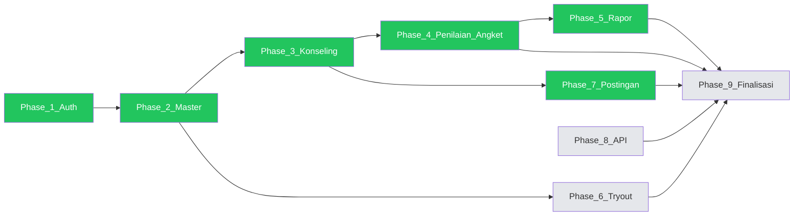

# Core Team Tracker — Sistem BK

**Tim:** Core (Anda)  
**Acuan roadmap:** Phase 1–9 (`docs/PROGRESS.md`)  
**Referensi lengkap:** `docs/FEATURE_BREAKDOWN.md` (semua modul + tim lain)  
**Terakhir diperbarui:** 2026-06-03 (branch `kela`)

---

## Cara baca dokumen ini


| Kolom / simbol | Arti                                                                       |
| -------------- | -------------------------------------------------------------------------- |
| ✅              | Selesai (core team)                                                        |
| 🔄             | Sedang dikerjakan                                                          |
| ⏳              | Belum mulai (tugas core team)                                              |
| ⚠️             | Ada di repo, **bukan** deliverable core — milik tim lain / perlu integrasi |
| 🔗             | Bergantung pada task/phase lain                                            |
| —              | Bukan scope core (hanya dicatat)                                           |


**Aturan prioritas**

1. Selesaikan **rantai core** Phase 1 → 2 → 3 → … sesuai dependensi.
2. Setelah phase aktif stabil, baru ambil **+1 fitur tambahan** (lihat § Fitur tambahan).
3. Modul tim lain **tidak di-rewrite**; core hanya integrasi (relasi FK, menu, status) bila perlu.

---

## Progress flow (core team)




**Legenda warna:** hijau = selesai · kuning = berikutnya · abu = belum

---

## Ringkasan cepat (update tiap sprint)


| Phase | Nama               | Status core | Progress | Owner |
| ----- | ------------------ | ----------- | -------- | ----- |
| 1     | Foundation & Auth  | ✅ Selesai   | 100%     | Core  |
| 2     | Data Master        | ✅ Selesai   | 100%     | Core  |
| 3     | Konseling & Jadwal | ✅ Selesai   | 100%     | Core  |
| 4     | Penilaian & Angket | ✅ Selesai   | 100%     | Core  |
| 5     | Rapor BK           | ✅ Selesai   | 100%     | Core  |
| 6     | Tryout             | ✅ Selesai   | 100%     | Core  |
| 7     | Postingan          | ✅ Selesai   | 100%     | Core  |
| 8     | API Layer          | ✅ Selesai   | 100%     | Core  |
| 9     | Finalisasi         | ✅ Selesai   | 100%     | Core  |


Persen = fondasi ada (tim lain / master data), **bukan** deliverable core lengkap.

---

## Tim lain (bukan tugas core — hanya integrasi)


| Modul                 | Status di repo | Owner           | Tindakan core                                         |
| --------------------- | -------------- | --------------- | ----------------------------------------------------- |
| Instrumen BK          | ⚠️ Ada         | Tim asesmen     | Pakai `master_questions` nanti; jangan duplikasi soal |
| Sosiometri            | ⚠️ Ada         | Tim asesmen     | —                                                     |
| RPL + cetak PDF       | ⚠️ Ada         | Tim dokumentasi | —                                                     |
| Jurnal bulanan        | ⚠️ Ada         | Tim dokumentasi | —                                                     |
| Feedback layanan      | ⚠️ Ada         | Tim konseling   | Ganti/extend ke `penilaian_pelayanan` di Phase 4      |
| Konseling dasar       | ⚠️ Ada         | Tim konseling   | **Phase 3:** lengkapi status, jadwal, kalender        |
| Karier info           | ⚠️ Ada         | Tim konten      | Beda dari postingan Phase 7                           |
| `schools` / `classes` | ⚠️ Duplikat    | Legacy          | Konsolidasi ke `sekolahs` / `kelas` saat Phase 9      |


---

# PHASE 1 — Foundation & Auth Core

**Status:** ✅ **SELESAI**  
**Dokumen:** `docs/phase-1-foundation.md`


| ID  | Task                                                   | Status | Bukti / file                          |
| --- | ------------------------------------------------------ | ------ | ------------------------------------- |
| 1.1 | Login admin / guru / siswa (satu guard, form per role) | ✅      | `AuthenticatedSessionController`      |
| 1.2 | Login siswa: NISN + tanggal lahir                      | ✅      | `storeStudentSession`                 |
| 1.3 | Siswa wajib `students.user_id` (no auto-create)        | ✅      | Migration unique `user_id`            |
| 1.4 | Throttle login siswa pakai NISN                        | ✅      | `LoginRequest`                        |
| 1.5 | Register siswa + guru BK (pending)                     | ✅      | Breeze + `GuruRegistrationController` |
| 1.6 | Reset password, verifikasi email                       | ✅      | `routes/auth.php`                     |
| 1.7 | Middleware `role:admin|guru|siswa`                     | ✅      | `EnsureUserHasRole`                   |
| 1.8 | Sanctum API                                            | ⏳      | Phase 8                               |
| 1.9 | Role `superadmin` / permission granular                | —      | Out of scope (tanpa Spatie)           |


---

# PHASE 2 — Data Master

**Status:** ✅ **SELESAI**  
**Dokumen:** `docs/phase-2-data-master.md`


| ID  | Task                               | Status | Route / tabel                                    |
| --- | ---------------------------------- | ------ | ------------------------------------------------ |
| 2.1 | CRUD Sekolah                       | ✅      | `admin.sekolah.`* → `sekolahs`                   |
| 2.2 | CRUD Kelas (per sekolah)           | ✅      | `admin.kelas.*` → `kelas`                        |
| 2.3 | CRUD Guru BK (+ user)              | ✅      | `admin.guru-bk.*` → `guru_bks`                   |
| 2.4 | CRUD Master Pertanyaan             | ✅      | `admin.master-pertanyaan.*` → `master_questions` |
| 2.5 | CRUD Kategori Postingan            | ✅      | `admin.kategori-postingan.*` → `post_categories` |
| 2.6 | Menu sidebar admin phase 2         | ✅      | `layouts/app.blade.php`                          |
| 2.7 | Siswa admin: filter per `kelas_id` | ✅      | `Admin\StudentController` (+2)                   |
| 2.8 | Siswa: form biodata lengkap        | ✅      | `jenis_kelamin`, `alamat`, `status_biodata` (otomatis) |


---

# PHASE 3 — Konseling & Jadwal

**Status:** ✅ **SELESAI**  
**🔗 Bergantung:** Phase 1, 2 (siswa, guru_bk, sekolah)

### Sudah ada (tim lain — core **tidak** hitung selesai)


| ID   | Task                                  | Status | Catatan                             |
| ---- | ------------------------------------- | ------ | ----------------------------------- |
| 3.T1 | Pengajuan siswa (store)               | ⚠️     | `siswa.consultation-requests.store` |
| 3.T2 | Guru: list, approve, schedule, report | ⚠️     | `guru.consultations.`*              |
| 3.T3 | Admin: pantau read-only               | ⚠️     | `admin.consultations.index`         |
| 3.T4 | Cetak PDF konseling                   | ⚠️     | `guru.consultations.print`          |
| 3.T5 | `case_category`, `follow_up`          | ⚠️     | Migration tim lain                  |


### Todo core team (centang saat selesai)


| ID  | Task                                                      | Status | Deliverable                                      |
| --- | --------------------------------------------------------- | ------ | ------------------------------------------------ |
| 3.1 | Status lengkap: `ditolak`, `dijadwalkan_ulang` + alasan   | ✅      | Migration + `ConsultationController`             |
| 3.2 | Halaman riwayat pengajuan siswa                           | ✅      | `siswa.consultations.index`                      |
| 3.3 | Form pengajuan sesuai blueprint (topik, preferensi waktu) | ✅      | `StoreConsultationRequest`                       |
| 3.4 | Endpoint JSON event untuk kalender                        | ✅      | `guru.consultations.events`                      |
| 3.5 | UI FullCalendar (CDN) di halaman guru konseling           | ✅      | FullCalendar 6 CDN                               |
| 3.6 | Cek ketersediaan jadwal (rule bentrok)                    | ✅      | `ConsultationScheduleService`                    |
| 3.7 | (Opsional) Tabel `jadwal_konseling` terpisah              | —      | Tidak dipakai (kolom di `consultation_requests`) |
| 3.8 | Widget dashboard: antrian + jadwal minggu ini             | ✅      | Guru & siswa                                     |
| 3.9 | Dokumen phase + zero bug                                  | ✅      | `docs/phase-3-konseling.md`                      |


**Definition of done Phase 3:** semua 3.1–3.6 ✅ + 3.9 ✅

---

# PHASE 4 — Penilaian & Angket

**Status:** ✅ **SELESAI**  
**Dokumen:** `docs/phase-4-penilaian-angket.md`  
**🔗 Bergantung:** Phase 3 (konseling `selesai`), Phase 2 (`master_questions`)


| ID  | Task                                                  | Status | Deliverable                        |
| --- | ----------------------------------------------------- | ------ | ---------------------------------- |
| 4.1 | Migration `penilaian_pelayanan` (3 skor + catatan)    | ✅      | 1x per konseling selesai           |
| 4.2 | Form siswa isi penilaian                              | ✅      | `siswa/penilaian/`*                |
| 4.3 | Guru: laporan agregat penilaian                       | ✅      | `guru/penilaian/*`                 |
| 4.4 | Flow angket dari `master_questions` (kategori angket) | ✅      | `respons_angket`                   |
| 4.5 | Guru: laporan angket + predikat                       | ✅      | `Guru\AngketController` + views    |
| 4.6 | PDF laporan angket (DomPDF)                           | ✅      | `guru.angket.pdf`                  |
| 4.7 | Integrasi / deprecate `service_feedback`              | ✅      | Docblock + `SERVICE_FEEDBACK_DEPRECATION.md` |
| 4.8 | Dokumen phase + zero bug                              | ✅      | 33 test Phase 4 PASS               |


---

# PHASE 5 — Rapor BK

**Status:** ✅ **SELESAI**  
**Dokumen:** `docs/phase-5-rapor.md`  
**🔗 Bergantung:** Phase 2 (siswa), Phase 4 (opsional untuk isi rapor)


| ID  | Task                                       | Status | Deliverable                  |
| --- | ------------------------------------------ | ------ | ---------------------------- |
| 5.1 | Migration `rapor_bk`                       | ✅      | semester, tahun, isi, status |
| 5.2 | Guru: daftar siswa + generate/update rapor | ✅      | `guru/rapor/`*               |
| 5.3 | `updateOrCreate` per siswa per semester    | ✅      | `RaporBkService`             |
| 5.4 | Download PDF rapor (DomPDF)                | ✅      | `guru.rapor.pdf`             |
| 5.5 | Admin: pantau rapor (read-only)            | ✅      | `admin/rapor/*`              |
| 5.6 | Dokumen phase + zero bug                   | ✅      | Test Phase 5 PASS            |


---

# PHASE 6 — Tryout

**Status:** ✅ **SELESAI**  
**Dokumen:** `docs/phase-6-tryout.md`  
**🔗 Bergantung:** Phase 2 (`master_questions` kategori tryout, `kelas`, siswa)


| ID  | Task                                                   | Status | Deliverable              |
| --- | ------------------------------------------------------ | ------ | ------------------------ |
| 6.1 | Migration `try_out`, `try_out_kelas`, `try_out_detail` | ✅      | `2026_06_03_000003_*`    |
| 6.2 | Guru: buat tryout + assign kelas                       | ✅      | `guru/tryout/*`          |
| 6.3 | Guru: lihat hasil & rata-rata                          | ✅      | `guru.tryout.show`       |
| 6.4 | Siswa: daftar, kerjakan, timer, submit                 | ✅      | `siswa/tryout/*`         |
| 6.5 | Riwayat tryout siswa                                   | ✅      | Index siswa              |
| 6.6 | Widget dashboard siswa: tryout aktif                   | ✅      | `siswa.dashboard`        |
| 6.7 | Dokumen phase + zero bug                               | ✅      | Test Phase 6 PASS        |


*Master pertanyaan tryout (admin) sudah ✅ di Phase 2.*

---

# PHASE 7 — Postingan

**Status:** ✅ **SELESAI**  
**Dokumen:** `docs/phase-7-postingan.md`  
**🔗 Bergantung:** Phase 2 (`post_categories` ✅)


| ID  | Task                                                     | Status | Deliverable                 |
| --- | -------------------------------------------------------- | ------ | --------------------------- |
| 7.1 | Migration `postingan` (judul, slug, isi, gambar, status) | ✅      | `postingan` table           |
| 7.2 | Admin CRUD postingan + upload gambar                     | ✅      | `admin/postingan/`*         |
| 7.3 | Siswa: baca postingan publik (list + detail)             | ✅      | `siswa/postingan/*`         |
| 7.4 | Filter + pagination postingan                            | ✅      | Index admin & siswa         |
| 7.5 | Widget dashboard: postingan terbaru                      | ✅      | Admin + siswa dashboard     |
| 7.6 | Dokumen phase + zero bug                                 | ✅      | Test Phase 7 PASS           |


*Kategori postingan sudah ✅ di Phase 2.*

---

# PHASE 8 — API Layer

**Status:** ✅ **SELESAI**  
**Dokumen:** `docs/phase-8-api.md`  
**🔗 Bergantung:** Phase 3+ stabil


| ID  | Task                                     | Status | Deliverable                      |
| --- | ---------------------------------------- | ------ | -------------------------------- |
| 8.1 | Install & config Sanctum                 | ✅      | `User::HasApiTokens`, migrate    |
| 8.2 | `routes/api.php` + prefix `v1`           | ✅      | `/api/v1/*`                      |
| 8.3 | Auth API: login, logout, me              | ✅      | `Api/V1/AuthController`          |
| 8.4 | Resource API: konseling, siswa (minimal) | ✅      | consultations, students          |
| 8.5 | Dokumen phase + Postman collection       | ✅      | `docs/phase-8-api.md`            |


---

# PHASE 9 — Finalisasi

**Status:** ✅ **SELESAI** (scope core)  
**Dokumen:** `docs/phase-9-finalisasi.md`  
**🔗 Bergantung:** Phase 3–8


| ID  | Task                                        | Status | Deliverable      |
| --- | ------------------------------------------- | ------ | ---------------- |
| 9.1 | Konsolidasi `sekolahs` vs `schools`         | ⏳      | Backlog deploy   |
| 9.2 | Dashboard admin lengkap (widget blueprint)  | ✅      | `coreSummary`    |
| 9.3 | `activity_logs` manual (tanpa Spatie)       | ✅      | Admin index      |
| 9.4 | Hapus / arsip `assessment_responses` legacy | ✅      | Doc deprecation  |
| 9.5 | QA regression + dokumentasi deploy          | ✅      | Test Phase 4–9   |
| 9.6 | `docs/phase-9-finalisasi.md`                | ✅      |                  |


---

## Fitur tambahan (+1 / +2 setelah core lane)

Ambil **maksimal 1–2** per sprint **setelah** task wajib phase aktif selesai.


| Prioritas  | Fitur                                     | Phase | Alasan                                              | Status                        |
| ---------- | ----------------------------------------- | ----- | --------------------------------------------------- | ----------------------------- |
| **+1**     | **Postingan artikel** (CRUD + siswa baca) | 7     | Kategori sudah ✅; impact tinggi, sedikit dependensi | ⏳ Rekomendasi setelah 3.1–3.3 |
| **+2**     | **Filter siswa per kelas** (admin)        | 2     | Quick win, melengkapi master                        | ⏳ Bisa paralel Phase 3        |
| Alternatif | Widget dashboard admin (sekolah aktif)    | 9 / 2 | Polish, bukan blocking                              | ⏳                             |


**Tidak disarankan sebagai +1/+2 sekarang:** Tryout (besar), API (butuh modul stabil), Rapor (butuh data konseling/penilaian).

---

## Sprint board (contoh — salin ke Notion/Trello)

### Sprint saat ini: **Core lane selesai** (branch `kela`)


| Todo              | Doing | Done        |
| ----------------- | ----- | ----------- |
| 6.x Tryout        |       | P1–P5 ✅     |
| 7.x Postingan (+1)|       |             |


**+1 opsional:** 7.1–7.3 Postingan artikel

---

## Checklist harian core team

```
Phase 1–5,7 [████████████████████] 100%  ✅
Phase 6,8–9 [████████████████████] 100% ✅

Hari ini:
[ ] Task ID: ___
[ ] Zero bug: php -l, route:list, migrate --pretend
[ ] Update baris status di tabel phase di dokumen ini
```

---

## Log perubahan tracker


| Tanggal    | Perubahan                                                                          |
| ---------- | ---------------------------------------------------------------------------------- |
| 2026-06-03 | Phase 5 Rapor BK ✅ di `kela`; modul tim tidak diubah |
| 2026-06-03 | Phase 4 ✅ di `kela`; tracker & PROGRESS disinkronkan |
| 2026-05-18 | Buat tracker core team; Phase 1–2 ✅; Phase 3 = next; +1 Postingan, +2 filter kelas |


---

## Link dokumen


| Dokumen                       | Isi                                           |
| ----------------------------- | --------------------------------------------- |
| `docs/PROGRESS.md`            | Ringkasan 1 baris per phase (dashboard cepat) |
| `docs/CORE_TEAM_TRACKER.md`   | **Ini** — task detail + flow                  |
| `docs/FEATURE_BREAKDOWN.md`   | Semua fitur blueprint + tim lain              |
| `docs/phase-1-foundation.md`  | Laporan Phase 1                               |
| `docs/phase-2-data-master.md` | Laporan Phase 2                               |


