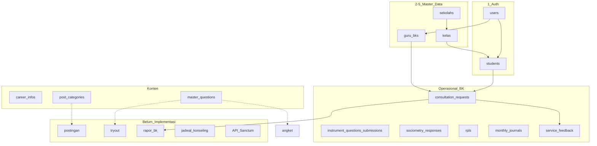

# Implementasi & Breakdown Fitur — Sistem BK

**Project:** `sistembk` (Laravel 13)  
**Acuan:** Daftar fitur blueprint tim (50+ modul)  
**Tanggal audit:** 2026-05-18  

> **Core team (prioritas & task harian):** `[CORE_TEAM_TRACKER.md](./CORE_TEAM_TRACKER.md)`  
> **Ringkasan phase:** `[PROGRESS.md](./PROGRESS.md)`

**Legenda status:**


| Simbol | Arti                                                                                   |
| ------ | -------------------------------------------------------------------------------------- |
| ✅      | **Sudah** — ada route + controller + view + tabel (lengkap atau hampir lengkap)        |
| ⚠️     | **Sebagian** — ada inti fitur, belum sesuai spesifikasi blueprint / belum lengkap      |
| ❌      | **Belum** — tidak ada di codebase                                                      |
| 🔀     | **Alternatif** — project punya modul setara dengan nama/struktur berbeda               |
| 🚫     | **Tidak dipakai** — blueprint pakai package/pola yang sengaja dihindari di project ini |


---

## Ringkasan eksekutif

### Core team (Phase 1–9) — baca ini dulu


| Phase       | Status core   | Progress                    |
| ----------- | ------------- | --------------------------- |
| 1 Auth      | ✅ Selesai     | 100%                        |
| 2 Master    | ✅ Selesai     | 100%                        |
| 3 Konseling | 🔄 Berikutnya | ~35% (dasar tim lain)       |
| 4–9         | ⏳ Belum       | 0% (kecuali fondasi master) |


**+1 / +2 fitur tambahan (setelah task wajib phase aktif):** Postingan artikel (P7) · Filter siswa per kelas (P2)

### Seluruh blueprint (termasuk tim lain)


| Kategori                            | Jumlah perkiraan  |
| ----------------------------------- | ----------------- |
| ✅ Sudah                             | ~22               |
| ⚠️ Sebagian                         | ~24               |
| ❌ Belum                             | ~28               |
| 🔀 Alternatif di project            | ~8 modul tambahan |
| 🚫 Tidak sesuai stack (Spatie dll.) | ~6 area           |


**Catatan tim:** Role di kode = `admin` | `guru` | `siswa` (bukan `guru_bk` / `superadmin` di kolom `users`). Profil Guru BK = tabel `guru_bks` + user `role=guru`.

---

## Peta relasi antar modul (untuk koordinasi tim)




---

## 1. AUTENTIKASI & OTORISASI


| #    | Fitur blueprint                           | Status | Implementasi di project                                                     | Relasi / tim     | Catatan                                    |
| ---- | ----------------------------------------- | ------ | --------------------------------------------------------------------------- | ---------------- | ------------------------------------------ |
| 1.1  | Login Guru BK (email/password)            | ✅      | `routes/auth.php`, `AuthenticatedSessionController`, `auth/login` role=guru | Semua modul guru |                                            |
| 1.2  | Login Siswa (NISN + tanggal lahir)        | ✅      | `AuthenticatedSessionController@storeStudentSession`, `students` ↔ `users`  | Modul siswa      | Wajib `students.user_id` terhubung         |
| 1.3  | Login multi-guard terpisah                | ⚠️     | Satu guard `web`; beda form via `selected_role`                             | Auth team        | Bukan guard `siswa` di `config/auth.php`   |
| 1.4  | Logout                                    | ✅      | `POST /logout`                                                              | Semua            |                                            |
| 1.5  | Sanctum API (token)                       | ❌      | —                                                                           | API team         | Perlu `laravel/sanctum`, `routes/api.php`  |
| 1.6  | Role `superadmin`                         | ❌      | —                                                                           | Admin team       | Hanya `admin`                              |
| 1.7  | Role `admin`, `guru_bk`, `siswa`          | ⚠️     | `users.role`: `admin`, `**guru**`, `siswa`                                  | Semua            | String role guru = `guru`, bukan `guru_bk` |
| 1.8  | Permission granular (manage-jadwal, dll.) | ❌      | Hanya `EnsureUserHasRole` middleware                                        | Semua            | 🚫 Tanpa Spatie Permission                 |
| 1.9  | Register (siswa)                          | ✅      | Breeze `RegisteredUserController`                                           | Siswa team       |                                            |
| 1.10 | Register Guru BK                          | ✅      | `/register/guru-bk`, status `pending`                                       | Admin approval   |                                            |
| 1.11 | Forgot / reset password                   | ✅      | Breeze                                                                      | Semua            |                                            |
| 1.12 | Email verification                        | ✅      | Breeze                                                                      | Semua            |                                            |
| 1.13 | Confirm password                          | ✅      | Breeze                                                                      | Admin, guru      |                                            |


**File kunci:** `app/Http/Middleware/EnsureUserHasRole.php`, `app/Models/User.php`, `config/auth.php`

---

## 2. MANAJEMEN SEKOLAH (ADMIN)


| #   | Fitur blueprint                       | Status | Implementasi                                                   | Relasi tim               | Catatan                                  |
| --- | ------------------------------------- | ------ | -------------------------------------------------------------- | ------------------------ | ---------------------------------------- |
| 2.1 | CRUD sekolah                          | ✅      | `Admin\SekolahController`, `sekolahs`, views `admin/sekolah/`* | Kelas (§3), Guru BK (§4) |                                          |
| 2.2 | Paket aktif + tanggal aktivasi        | ✅      | Kolom `paket_aktif`, `tanggal_aktivasi`                        | —                        |                                          |
| 2.3 | Activate/deactivate                   | ✅      | Kolom `is_active` + filter admin                               | Dashboard (§13)          |                                          |
| 2.4 | Monitoring sekolah aktif di dashboard | ⚠️     | Dashboard admin ada metrik umum                                | Dashboard team           | Belum widget khusus sekolah aktif        |
| 2.5 | —                                     | 🔀     | Tabel paralel `schools` + `users.school_id`                    | Tim demo / legacy        | Konsolidasi dengan `sekolahs` disarankan |


**Route:** `admin.sekolah.`*  
**Tabel:** `sekolahs`

---

## 3. MANAJEMEN KELAS (ADMIN)


| #   | Fitur blueprint        | Status | Implementasi                     | Relasi tim               | Catatan                                  |
| --- | ---------------------- | ------ | -------------------------------- | ------------------------ | ---------------------------------------- |
| 3.1 | CRUD kelas per sekolah | ✅      | `Admin\KelasController`, `kelas` | Sekolah (§2), Siswa (§5) |                                          |
| 3.2 | Jenjang SD/SMP/SMA     | ⚠️     | Field `jenjang` (string bebas)   | —                        | Belum enum ketat                         |
| 3.3 | Tingkatan 1–12         | ⚠️     | Field `tingkatan` (string bebas) | —                        |                                          |
| 3.4 | —                      | 🔀     | `guidance_classes` + kode join   | Siswa, asesmen           | **Bukan** kelas akademik; modul terpisah |


**Route:** `admin.kelas.`*  
**Tabel:** `kelas` (FK `sekolah_id`)

---

## 4. MANAJEMEN GURU BK


| #   | Fitur blueprint                           | Status | Implementasi                         | Relasi tim                  | Catatan             |
| --- | ----------------------------------------- | ------ | ------------------------------------ | --------------------------- | ------------------- |
| 4.1 | CRUD Guru BK (nip, jabatan, bidang studi) | ✅      | `Admin\GuruBkController`, `guru_bks` | Sekolah, users              |                     |
| 4.2 | Buat user otomatis                        | ✅      | `store()` create User role=guru      | Auth (§1)                   |                     |
| 4.3 | Relasi sekolah & user                     | ✅      | FK `sekolah_id`, `user_id`           | §2, §1                      |                     |
| 4.4 | Dashboard: statistik pengajuan            | ⚠️     | `Guru\DashboardController` — antrian | Konseling (§6)              |                     |
| 4.5 | Dashboard: jadwal mingguan                | ❌      | —                                    | Konseling + kalender        |                     |
| 4.6 | Dashboard: rata-rata skor kepuasan        | ❌      | —                                    | Penilaian (§8), Angket (§9) |                     |
| 4.7 | Approval pendaftaran guru                 | ✅      | `Admin\AdminApprovalController`      | Auth                        | Tambahan di project |


**Route:** `admin.guru-bk.`*, `admin.approvals.*`  
**Tabel:** `guru_bks`, `users`

---

## 5. MANAJEMEN SISWA


| #    | Fitur blueprint              | Status | Implementasi                                    | Relasi tim        | Catatan                   |
| ---- | ---------------------------- | ------ | ----------------------------------------------- | ----------------- | ------------------------- |
| 5.1  | CRUD siswa (admin)           | ✅      | `Admin\StudentController`, `students`           | Kelas, users      |                           |
| 5.2  | CRUD/import siswa (guru)     | ✅      | `Guru\StudentController`, import CSV            | Guru BK           | Tambahan di project       |
| 5.3  | nisn, nama, tanggal lahir    | ✅      | Kolom + validasi                                | Login siswa       |                           |
| 5.4  | jenis_kelamin, alamat        | ⚠️     | Ada di migration; perlu cek form admin lengkap  | —                 |                           |
| 5.5  | status_biodata               | ⚠️     | Kolom `status_biodata`                          | Instrumen, angket |                           |
| 5.6  | tanggal isi kuisioner        | ❌      | —                                               | Instrumen/angket  |                           |
| 5.7  | Relasi kelas & user          | ✅      | `kelas_id`, `user_id` (unique)                  | §3, §1            |                           |
| 5.8  | Dashboard: pengajuan terbaru | ⚠️     | `Siswa\DashboardController`                     | §6                |                           |
| 5.9  | Dashboard: jadwal mendatang  | ❌      | —                                               | §6 kalender       |                           |
| 5.10 | Dashboard: tryout tersedia   | ❌      | —                                               | §11               |                           |
| 5.11 | Dashboard: postingan terbaru | ❌      | —                                               | §12               |                           |
| 5.12 | Join kelas bimbingan (kode)  | ✅      | `Siswa\ClassJoinController`, `guidance_classes` | Modul BK kelas    | 🔀 Bukan `kelas` akademik |


**Route:** `admin.students.`*, `guru.students.*`, `siswa.classes.join`  
**Tabel:** `students`, `guidance_class_student`

---

## 6. SISTEM KONSELING (PENGAJUAN & JADWAL)


| #    | Fitur blueprint            | Status | Implementasi                                | Relasi tim        | Catatan                                                                              |
| ---- | -------------------------- | ------ | ------------------------------------------- | ----------------- | ------------------------------------------------------------------------------------ |
| 6.1  | Siswa ajukan konseling     | ⚠️     | `Siswa\ConsultationRequestController@store` | Guru BK, users    | Pilih guru + keluhan; belum semua field blueprint                                    |
| 6.2  | Siswa riwayat pengajuan    | ⚠️     | List di `siswa/dashboard`                   | —                 | Belum halaman riwayat dedicated                                                      |
| 6.3  | Guru lihat pengajuan masuk | ✅      | `Guru\ConsultationController@index`         | Siswa, guru       |                                                                                      |
| 6.4  | Update status lengkap      | ⚠️     | `approve`, `schedule`, `report`             | —                 | Status: `pending`, `disetujui`, `selesai` — **tanpa** `ditolak`, `dijadwalkan_ulang` |
| 6.5  | Generate jadwal otomatis   | ⚠️     | Kolom di `consultation_requests`            | —                 | Bukan tabel `jadwal_konseling` terpisah                                              |
| 6.6  | Cek ketersediaan jadwal    | ❌      | —                                           | API/kalender team |                                                                                      |
| 6.7  | Kalender FullCalendar      | ❌      | —                                           | Frontend team     |                                                                                      |
| 6.8  | Admin pantau konseling     | ✅      | `Admin\ConsultationController@index`        | —                 | Read-only                                                                            |
| 6.9  | Cetak laporan konseling    | ✅      | `guru.consultations.print`                  | DomPDF (§15)      |                                                                                      |
| 6.10 | Kategori kasus             | ✅      | `case_category`, `follow_up`                | —                 | Tambahan project                                                                     |


**Route:** `siswa.consultation-requests.store`, `guru.consultations.`*, `admin.consultations.index`  
**Tabel:** `consultation_requests` (bukan `pengajuan_konseling` + `jadwal_konseling`)

**Dependensi tim:** Butuh §1 (siswa login), §4 (guru), §5 (profil siswa).

---

## 7. MASTER PERTANYAAN


| #   | Fitur blueprint               | Status | Implementasi                                         | Relasi tim         | Catatan                                           |
| --- | ----------------------------- | ------ | ---------------------------------------------------- | ------------------ | ------------------------------------------------- |
| 7.1 | CRUD master pertanyaan        | ✅      | `Admin\MasterQuestionController`, `master_questions` | §9, §11            |                                                   |
| 7.2 | Kategori angket / tryout      | ✅      | Enum `kategori`                                      | Tryout belum jalan |                                                   |
| 7.3 | Tipe input (PG, skala, isian) | ✅      | Kolom `tipe_input`                                   | —                  |                                                   |
| 7.4 | Toggle aktif/nonaktif         | ✅      | `is_active`                                          | —                  |                                                   |
| 7.5 | Filter kategori & status      | ✅      | Index + query params                                 | —                  |                                                   |
| 7.6 | Dipakai angket guru           | ❌      | —                                                    | §9                 | Tabel ada, flow belum                             |
| 7.7 | Dipakai tryout                | ❌      | —                                                    | §11                |                                                   |
| 7.8 | —                             | 🔀     | `instrument_questions` (Guru CRUD)                   | Instrumen BK       | **Sistem soal terpisah** — koordinasi tim asesmen |


**Route:** `admin.master-pertanyaan.`*  
**Tabel:** `master_questions`, `instrument_questions` (alternatif)

---

## 8. PENILAIAN PELAYANAN (EVALUASI KONSELING)


| #   | Fitur blueprint                                           | Status | Implementasi                        | Relasi tim | Catatan                           |
| --- | --------------------------------------------------------- | ------ | ----------------------------------- | ---------- | --------------------------------- |
| 8.1 | Siswa: 3 skor (kepuasan, komunikasi, kejelasan) + catatan | ❌      | —                                   | §6 selesai | Butuh tabel `penilaian_pelayanan` |
| 8.2 | Guru: laporan penilaian diri                              | ❌      | —                                   | —          |                                   |
| 8.3 | Validasi 1x per pengajuan                                 | ❌      | —                                   | §6         |                                   |
| 8.4 | —                                                         | ⚠️     | `service_feedback` (rating + pesan) | §6         | Modul feedback, bukan 3 skor      |


**Route:** `siswa.feedback.`*, `guru.feedback.index`  
**Tabel:** `service_feedback` (bukan `penilaian_pelayanan`)

---

## 9. ANGKET PENILAIAN GURU


| #   | Fitur blueprint                         | Status | Implementasi                 | Relasi tim    | Catatan                |
| --- | --------------------------------------- | ------ | ---------------------------- | ------------- | ---------------------- |
| 9.1 | Siswa isi angket dari master pertanyaan | ❌      | —                            | §7            |                        |
| 9.2 | Guru laporan + predikat                 | ❌      | —                            | —             |                        |
| 9.3 | Download PDF laporan angket             | ❌      | —                            | §15           |                        |
| 9.4 | —                                       | 🔀     | Sosiometri siswa + peta guru | §7 instrument | Bukan angket blueprint |


**Route:** `siswa.sociometry.`*, `guru.sociometry.index`  
**Tabel:** `sociometry_responses`

---

## 10. RAPOR BK


| #    | Fitur blueprint                       | Status | Implementasi                   | Relasi tim       | Catatan                    |
| ---- | ------------------------------------- | ------ | ------------------------------ | ---------------- | -------------------------- |
| 10.1 | Generate rapor per siswa per semester | ❌      | —                              | §5 siswa         | Tabel `rapor_bk` belum ada |
| 10.2 | Daftar siswa + status rapor           | ❌      | —                              | —                |                            |
| 10.3 | updateOrCreate rapor                  | ❌      | —                              | —                |                            |
| 10.4 | Download PDF rapor                    | ❌      | —                              | §15 DomPDF       | Package sudah ada          |
| 10.5 | —                                     | 🔀     | **RPL** + cetak PDF            | Guru dokumentasi | Modul berbeda              |
| 10.6 | —                                     | 🔀     | **Jurnal bulanan** + cetak PDF | Guru dokumentasi | Modul berbeda              |


**Route:** `guru.rpls.`*, `guru.journals.*`  
**Tabel:** `rpls`, `monthly_journals`

---

## 11. TRYOUT


| #    | Fitur blueprint                 | Status | Implementasi                       | Relasi tim        | Catatan          |
| ---- | ------------------------------- | ------ | ---------------------------------- | ----------------- | ---------------- |
| 11.1 | Guru buat tryout + assign kelas | ❌      | —                                  | §3 kelas, §7 soal |                  |
| 11.2 | Soal dari master pertanyaan     | ❌      | —                                  | §7                |                  |
| 11.3 | Guru lihat hasil & rata-rata    | ❌      | —                                  | —                 |                  |
| 11.4 | Siswa daftar & kerjakan tryout  | ❌      | —                                  | §5                |                  |
| 11.5 | Timer + submit + riwayat        | ❌      | —                                  | Frontend          |                  |
| 11.6 | —                               | ⚠️     | `master_questions.kategori=tryout` | Admin only        | Data master saja |


**Tabel belum ada:** `try_out`, `try_out_kelas`, `try_out_detail`

---

## 12. MANAJEMEN POSTINGAN / INFORMASI (ADMIN)


| #    | Fitur blueprint                           | Status | Implementasi                                      | Relasi tim        | Catatan                                         |
| ---- | ----------------------------------------- | ------ | ------------------------------------------------- | ----------------- | ----------------------------------------------- |
| 12.1 | CRUD kategori postingan                   | ✅      | `Admin\PostCategoryController`, `post_categories` | Postingan (belum) |                                                 |
| 12.2 | CRUD postingan (judul, isi, slug, gambar) | ❌      | —                                                 | §12               | Tabel `postingan` belum ada                     |
| 12.3 | Siswa baca postingan publik               | ❌      | —                                                 | —                 |                                                 |
| 12.4 | —                                         | 🔀     | **Informasi karier**                              | Admin + siswa     | `career_infos` — konten serupa, bukan postingan |


**Route:** `admin.kategori-postingan.`*, `admin.careers.*`, `siswa.careers.index`  
**Tabel:** `post_categories`, `career_infos`

---

## 13. DASHBOARD MULTI-ROLE


| #    | Fitur blueprint           | Status | Implementasi                | Relasi tim | Catatan                    |
| ---- | ------------------------- | ------ | --------------------------- | ---------- | -------------------------- |
| 13.1 | Admin: total users        | ✅      | `Admin\DashboardController` | §1         |                            |
| 13.2 | Admin: total postingan    | ❌      | —                           | §12        |                            |
| 13.3 | Admin: sekolah aktif      | ⚠️     | Metrik umum                 | §2         |                            |
| 13.4 | Admin: postingan terbaru  | ❌      | —                           | §12        |                            |
| 13.5 | Guru: statistik pengajuan | ⚠️     | Dashboard guru              | §6         |                            |
| 13.6 | Guru: jadwal mingguan     | ❌      | —                           | §6         |                            |
| 13.7 | Guru: rata-rata skor      | ❌      | —                           | §8, §9     |                            |
| 13.8 | Siswa: pengajuan + jadwal | ⚠️     | Dashboard siswa             | §6         | Jadwal belum widget khusus |
| 13.9 | Siswa: tryout + postingan | ❌      | —                           | §11, §12   |                            |


---

## 14. ACTIVITY LOG


| #    | Fitur blueprint         | Status | Implementasi | Relasi tim  | Catatan                                              |
| ---- | ----------------------- | ------ | ------------ | ----------- | ---------------------------------------------------- |
| 14.1 | Log semua aksi penting  | ❌      | —            | Semua modul | 🚫 Manual `activity_logs` direncanakan, bukan Spatie |
| 14.2 | Halaman admin lihat log | ❌      | —            | Admin       |                                                      |


**Tabel belum ada:** `activity_logs`

---

## 15. PDF GENERATION


| #    | Fitur blueprint    | Status | Implementasi               | Relasi tim     | Catatan                                   |
| ---- | ------------------ | ------ | -------------------------- | -------------- | ----------------------------------------- |
| 15.1 | Spatie PDF         | 🚫     | —                          | —              | Project pakai **barryvdh/laravel-dompdf** |
| 15.2 | PDF Rapor BK       | ❌      | —                          | §10            |                                           |
| 15.3 | PDF Laporan angket | ❌      | —                          | §9             |                                           |
| 15.4 | PDF Konseling      | ✅      | `guru.consultations.print` | §6             |                                           |
| 15.5 | PDF RPL            | ✅      | `guru.rpls.print`          | §10 alternatif |                                           |
| 15.6 | PDF Jurnal bulanan | ✅      | `guru.journals.print`      | §10 alternatif |                                           |


**Package:** `barryvdh/laravel-dompdf ^3.1`

---

## 17. FILTER & QUERY BUILDER


| #    | Fitur blueprint       | Status | Implementasi                       | Relasi tim | Catatan                |
| ---- | --------------------- | ------ | ---------------------------------- | ---------- | ---------------------- |
| 17.1 | Spatie Query Builder  | 🚫     | —                                  | —          | Filter manual Eloquent |
| 17.2 | Filter pengajuan      | ⚠️     | Filter status di index guru/admin  | §6         |                        |
| 17.3 | Filter pertanyaan     | ✅      | Admin master pertanyaan            | §7         |                        |
| 17.4 | Filter postingan      | ❌      | —                                  | §12        |                        |
| 17.5 | Pagination semua list | ✅      | `paginate(10)` di kebanyakan index | Semua CRUD |                        |


---

## 18. DEBUGGING & MONITORING


| #    | Fitur blueprint   | Status | Implementasi                 | Relasi tim | Catatan |
| ---- | ----------------- | ------ | ---------------------------- | ---------- | ------- |
| 18.1 | Laravel Pail      | ✅      | `composer.json` script `dev` | DevOps     |         |
| 18.2 | Laravel Telescope | ❌      | —                            | Dev        |         |
| 18.3 | Laravel Debugbar  | ❌      | —                            | Dev        |         |


---

## 19. UI / FRONTEND


| #    | Fitur blueprint       | Status | Implementasi                         | Relasi tim     | Catatan |
| ---- | --------------------- | ------ | ------------------------------------ | -------------- | ------- |
| 19.1 | Tailwind CSS          | ✅      | `tailwind.config.js`, `app.css`      | Semua view     |         |
| 19.2 | Alpine.js             | ✅      | `resources/js/app.js`                | Modal, sidebar |         |
| 19.3 | Vite                  | ✅      | `vite.config.js`                     | Build assets   |         |
| 19.4 | Layout role-based     | ✅      | `layouts/app.blade.php`              | Per role menu  |         |
| 19.5 | Responsive + komponen | ✅      | `components/`* (modal, alert, badge) | UX tim         |         |


---

## 20. DATABASE (BLUEPRINT vs AKTUAL)

### Blueprint (32 tabel) — status di project


| Tabel blueprint                             | Status | Tabel aktual di project                 |
| ------------------------------------------- | ------ | --------------------------------------- |
| users                                       | ✅      | `users`                                 |
| personal_access_tokens                      | ❌      | —                                       |
| sekolah                                     | ✅      | `sekolahs` (+ duplikat `schools`)       |
| kelas                                       | ✅      | `kelas` (+ duplikat `classes`)          |
| guru_bk                                     | ✅      | `guru_bks`                              |
| siswa                                       | ⚠️     | `students` (nama berbeda)               |
| pengajuan_konseling                         | ⚠️     | `consultation_requests` (gabung jadwal) |
| jadwal_konseling                            | ❌      | — (kolom di consultation_requests)      |
| master_pertanyaan                           | ✅      | `master_questions`                      |
| penilaian_pelayanan                         | ❌      | —                                       |
| respons_angket / jawaban_angket             | ❌      | —                                       |
| rapor_bk                                    | ❌      | —                                       |
| try_out / try_out_kelas / try_out_detail    | ❌      | —                                       |
| kategori_postingan                          | ✅      | `post_categories`                       |
| postingan                                   | ❌      | —                                       |
| Spatie roles/permissions/activity_log/media | 🚫     | Tidak dipakai                           |


### Tabel tambahan di project (tidak di list blueprint)


| Tabel                                                                  | Modul                       | Tim owner disarankan  |
| ---------------------------------------------------------------------- | --------------------------- | --------------------- |
| `guidance_classes`, `guidance_class_student`                           | Kelas bimbingan + join kode | Siswa / BK            |
| `career_infos`                                                         | Informasi karier            | Konten                |
| `instrument_questions`, `instrument_submissions`, `instrument_answers` | Instrumen BK                | Asesmen               |
| `sociometry_responses`                                                 | Sosiometri                  | Asesmen               |
| `rpls`                                                                 | Rencana Program Layanan     | Guru dokumentasi      |
| `monthly_journals`                                                     | Jurnal bulanan              | Guru dokumentasi      |
| `service_feedback`                                                     | Feedback layanan            | Konseling / penilaian |
| `assessment_responses`                                                 | Legacy (tidak dipakai)      | — hapus atau migrasi  |


---

## Breakdown implementasi per tim (sudah ada)

### Tim Auth & Admin platform


| Deliverable      | Status | Path / artefak                                   |
| ---------------- | ------ | ------------------------------------------------ |
| Login multi-role | ✅      | `AuthenticatedSessionController`, `LoginRequest` |
| Approval guru    | ✅      | `AdminApprovalController`                        |
| CRUD users       | ✅      | `Admin\UserController`                           |
| Middleware role  | ✅      | `EnsureUserHasRole`                              |


### Tim Master data


| Deliverable        | Status | Path / artefak                  |
| ------------------ | ------ | ------------------------------- |
| Sekolah            | ✅      | `SekolahController`, `sekolahs` |
| Kelas              | ✅      | `KelasController`, `kelas`      |
| Guru BK            | ✅      | `GuruBkController`, `guru_bks`  |
| Siswa (admin)      | ✅      | `StudentController`, `students` |
| Master pertanyaan  | ✅      | `MasterQuestionController`      |
| Kategori postingan | ✅      | `PostCategoryController`        |


### Tim Konseling


| Deliverable     | Status | Path / artefak                  |
| --------------- | ------ | ------------------------------- |
| Pengajuan siswa | ⚠️     | `ConsultationRequestController` |
| Workflow guru   | ⚠️     | `Guru\ConsultationController`   |
| Pantau admin    | ✅      | `Admin\ConsultationController`  |
| Cetak PDF       | ✅      | `print` view                    |


### Tim Asesmen / Instrumen (tambahan project)


| Deliverable         | Status | Path / artefak                                    |
| ------------------- | ------ | ------------------------------------------------- |
| Bank soal instrumen | ✅      | `InstrumentQuestionController`                    |
| Siswa isi instrumen | ✅      | `InstrumentSubmissionController`                  |
| Hasil instrumen     | ✅      | `InstrumentResultController`                      |
| Sosiometri          | ✅      | `SociometryController`, `SociometryMapController` |


### Tim Dokumentasi Guru (tambahan project)


| Deliverable          | Status | Path / artefak    |
| -------------------- | ------ | ----------------- |
| RPL + PDF            | ✅      | `RplController`   |
| Jurnal bulanan + PDF | ✅      | `guru.journals.*` |


### Tim Konten


| Deliverable       | Status | Path / artefak                         |
| ----------------- | ------ | -------------------------------------- |
| Informasi karier  | ✅      | `CareerInfoController`, `career_infos` |
| Postingan artikel | ❌      | Hanya kategori                         |


---

## Daftar fitur BELUM — breakdown implementasi rencana

Prioritas disarankan dengan **dependensi relasi**:

### Prioritas A — fondasi data (blocking banyak modul)


| ID  | Fitur belum                             | Dependensi | Artefak yang perlu dibuat               |
| --- | --------------------------------------- | ---------- | --------------------------------------- |
| B1  | Konsolidasi `sekolahs` vs `schools`     | §2, §5     | Migration data + satu model canonical   |
| B2  | Status konseling lengkap + tolak/alasan | §6         | Migration enum status + controller      |
| B3  | Tabel `jadwal_konseling` (opsional)     | §6         | Migration + model + relasi ke pengajuan |
| B4  | Halaman riwayat pengajuan siswa         | §6         | Route + view                            |


### Prioritas B — modul inti blueprint


| ID  | Fitur belum                    | Dependensi     | Artefak                                 |
| --- | ------------------------------ | -------------- | --------------------------------------- |
| B5  | `penilaian_pelayanan`          | §6 selesai     | Migration, model, controller siswa/guru |
| B6  | Angket dari `master_questions` | §7, §5         | Flow siswa + laporan guru               |
| B7  | `postingan` CRUD + siswa baca  | §12 kategori   | Migration, storage gambar, views        |
| B8  | `rapor_bk` + PDF               | §5, §15 DomPDF | Migration, controller, blade PDF        |
| B9  | Tryout full module             | §7, §3, §5     | 3 tabel + timer UI siswa                |


### Prioritas C — platform & polish


| ID  | Fitur belum                    | Dependensi     | Artefak                                     |
| --- | ------------------------------ | -------------- | ------------------------------------------- |
| B10 | Kalender FullCalendar          | §6, API events | Route JSON + view CDN                       |
| B11 | Sanctum API `/api/v1`          | §1             | sanctum, routes/api.php, resources          |
| B12 | `activity_logs` manual         | Semua          | Trait + migration + admin index             |
| B13 | Dashboard widget lengkap       | B5–B9          | Update dashboard controllers                |
| B14 | Permission granular (opsional) | §1             | Tetap manual enum/ middleware, tanpa Spatie |
| B15 | Role `superadmin`              | §1             | Migration + seeder                          |


---

## Matriks dependensi antar fitur (koordinasi tim)


| Modul               | Bergantung pada                             | Memblokir                 |
| ------------------- | ------------------------------------------- | ------------------------- |
| Login siswa         | `students` + `users`                        | Semua fitur siswa         |
| Konseling           | users (guru, siswa), optional kelas         | Penilaian, feedback       |
| Penilaian pelayanan | konseling `selesai`                         | Dashboard skor guru       |
| Angket              | `master_questions` aktif                    | Laporan angket PDF        |
| Tryout              | `master_questions`, `kelas`, siswa di kelas | Dashboard siswa tryout    |
| Postingan           | `post_categories`                           | Dashboard postingan siswa |
| Rapor BK            | profil siswa, guru BK                       | —                         |
| API mobile          | Sanctum, semua modul di atas                | —                         |


---

## Checklist singkat untuk daily standup tim

```
[✅] Auth 3 role + login siswa NISN
[✅] Master: sekolah, kelas, guru_bk, siswa, master_pertanyaan, kategori_postingan
[✅] Konseling dasar + cetak
[✅] Instrumen + sosiometri + RPL + jurnal + karier + kelas bimbingan
[⚠️] Konseling status lengkap + kalender + riwayat
[⚠️] Dashboard widget sesuai blueprint
[❌] Tryout, rapor_bk, postingan, penilaian 3 skor, angket formal, API, activity log
```

---

## Referensi file pusat


| Area           | File                                                        |
| -------------- | ----------------------------------------------------------- |
| Routes         | `routes/web.php`, `routes/auth.php`                         |
| Models         | `app/Models/*.php`                                          |
| Migrations     | `database/migrations/*.php`                                 |
| Progress phase | `docs/PROGRESS.md`                                          |
| Phase 1–2      | `docs/phase-1-foundation.md`, `docs/phase-2-data-master.md` |


---

*Dokumen ini fokus pada list fitur blueprint tim, dengan catatan relasi dan modul tambahan yang sudah ada di repository agar koordinasi antar anggota tim tetap jelas.*