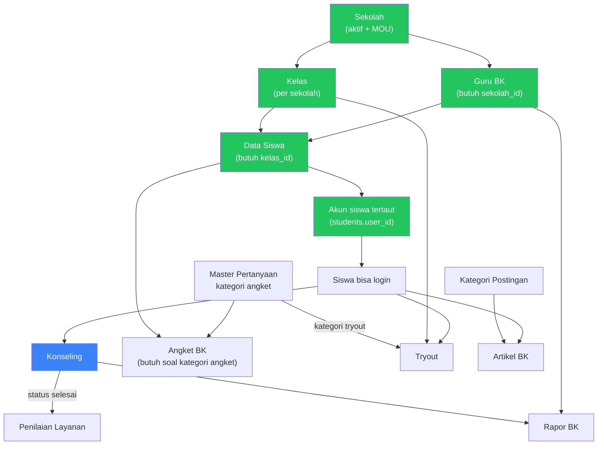
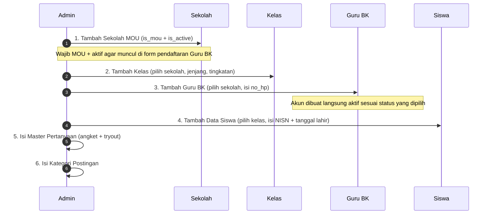
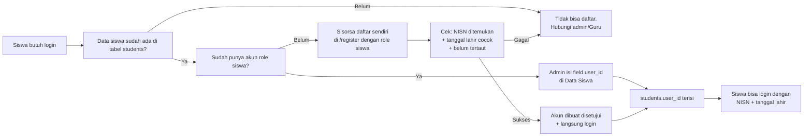
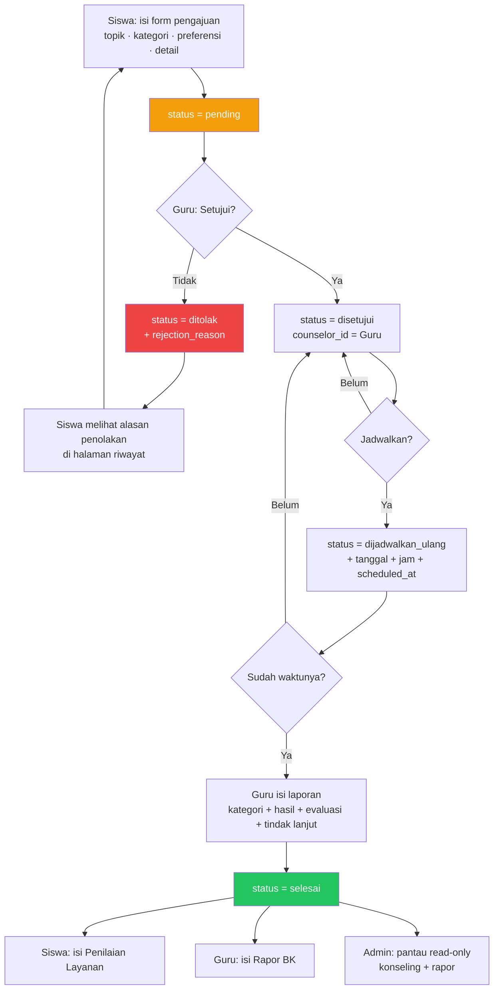
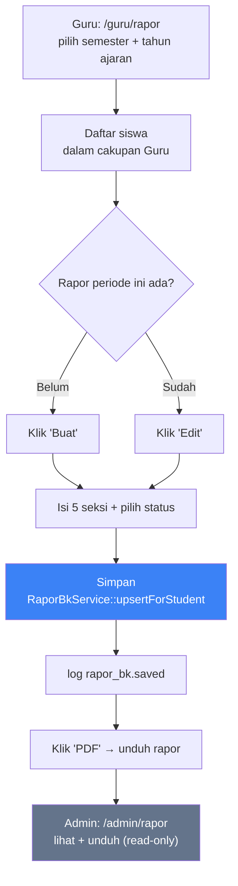
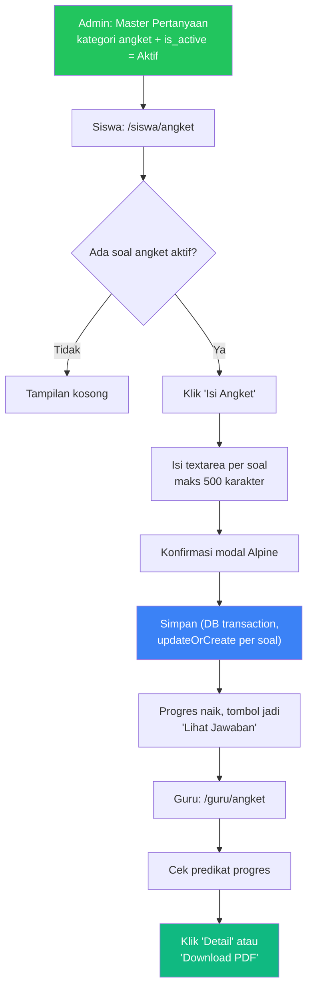
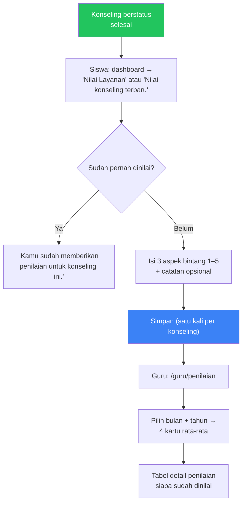
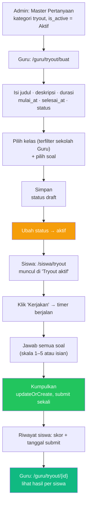
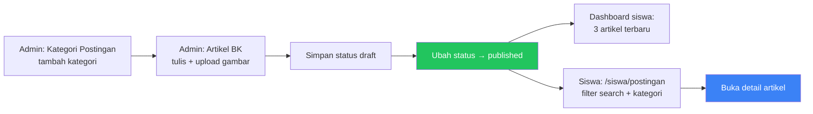
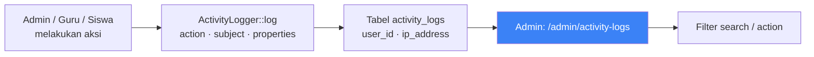

# Panduan Fitur Core — Sistem Bimbingan Konseling (BKK) Sekolah

Dokumen ini adalah panduan operasional **end-to-end khusus fitur core team** pada Sistem BKK
Sekolah: **Phase 1 sampai Phase 9**. Seluruh isi disusun dari pembacaan langsung kode sumber
Laravel di repository `sistembk` — route, controller, form request, model, dan view Blade.

> **Untuk panduan seluruh modul (termasuk modul tim lain)** — instrumen, sosiometri, RPL, jurnal,
> informasi karier, kelas bimbingan, chatbot — gunakan
> [`docs/PANDUAN-PENGGUNAAN.md`](./PANDUAN-PENGGUNAAN.md).
>
> Nama route, nama field, konstanta status, aturan validasi, dan seluruh string pesan disalin apa
> adanya dari kode — bukan hasil penafsiran.

---

## Daftar Isi

| # | Bagian | Phase |
|---|---|---|
| 0 | [Alur End-to-End](#0-alur-end-to-end) | — |
| 1 | [Batas Cakupan](#1-batas-cakupan) | — |
| 2 | [Autentikasi](#2-autentikasi) | P1 |
| 3 | [Pendaftaran](#3-pendaftaran) | P1 |
| 4 | [Profil & Keluar](#4-profil--keluar) | P1 |
| 5 | [Persetujuan Guru BK](#5-persetujuan-guru-bk) | P1 |
| 6 | [Data Master](#6-data-master) | P2 |
| 7 | [Konseling & Jadwal](#7-konseling--jadwal) | P3 |
| 8 | [Penilaian Layanan](#8-penilaian-layanan) | P4 |
| 9 | [Angket BK](#9-angket-bk) | P4 |
| 10 | [Rapor BK](#10-rapor-bk) | P5 |
| 11 | [Tryout](#11-tryout) | P6 |
| 12 | [Artikel BK (Postingan)](#12-artikel-bk-postingan) | P7 |
| 13 | [API Layer](#13-api-layer) | P8 |
| 14 | [Dashboard](#14-dashboard) | P9 |
| 15 | [Activity Log](#15-activity-log) | P9 |
| 16 | [Daftar Route Core](#16-daftar-route-core) | — |
| 17 | [Known Issues Core](#17-known-issues-core) | — |

---

## 0. Alur End-to-End

Bagian ini menjawab pertanyaan "dari mana saya mulai, lalu apa berikutnya, dan apa yang jadi
prasyarat". Setiap alur ditulis sesuai urutan eksekusi kode, bukan urutan tampilan menu.

### 0.1 Peta Dependensi Modul

Tidak semua modul bisa langsung dipakai. Prasyarat berikut bersifat **hard** — tanpa salah
satunya, modul berikutnya tidak bisa diisi datanya.



### 0.2 Atur Urutan — Jangan Melompat

| ❌ Urutan salah | ✅ Akibatnya |
|---|---|
| Buat Guru BK sebelum Sekolah | Guru tidak punya `sekolah_id` → daftar siswa Guru **kosong** (deny-by-default) |
| Buat Siswa sebelum Kelas | Field `kelas_id` wajib → form tidak bisa disimpan |
| Ajukan Konseling tanpa Guru BK `status = disetujui` | Daftar Guru BK kosong, siswa tidak bisa memilih |
| Guru buat Tryout tanpa soal kategori `tryout` | "Belum ada soal tryout aktif." |
| Admin buat Artikel tanpa Kategori | Field `post_category_id` wajib |
| Siswa isi Angket/Penilaian/Tryout tanpa profil tertaut | Ditolak `profileOrFail()` |

### 0.3 Kapan Siswa Masuk Cakupan Guru

`CounselorStudentService` menentukan siswa mana yang terlihat oleh Guru. Guru melihat siswa
**jika salah satu** kondisi berikut terpenuhi:

| Sumber | Syarat masuk cakupan |
|---|---|
| Sekolah | `students.kelas_id` → `kelas.sekolah_id` = `guru_bks.sekolah_id` milik Guru |
| Riwayat konseling | Ada `consultation_requests` dengan `counselor_id` = Guru tersebut |
| Riwayat rapor | Ada `rapor_bk` dengan `counselor_id` = Guru tersebut |

> **Deny-by-default:** Guru yang `sekolah_id`-nya kosong **dan** belum punya riwayat konseling
> atau rapor akan melihat **nol** siswa (`whereRaw('1 = 0')`) — bukan seluruh siswa.

> **Dua konvensi `student_id` berbeda** — perhatikan saat menelusuri data:
>
> | Tabel | `student_id` merujuk ke |
> |---|---|
> | `consultation_requests` | `users.id` |
> | `rapor_bk` | `students.id` |
>
> Itulah alasan service melakukan pemetaan `whereIn('user_id', $userIds)` untuk konseling.
> Modul yang memuat `student_id` dari hidden input form harus konsisten dengan tabelnya.

### 0.4 Alur 1 — Orientasi Admin (Sekali Aja)



| # | Langkah | Route | Catatan penting |
|---|---|---|---|
| 1 | Tambah Sekolah MOU | `admin.sekolah.store` | `is_mou = 1` **dan** `is_active = 1` — dua-duanya syarat agar muncul di form pendaftaran Guru BK |
| 2 | Tambah Kelas | `admin.kelas.store` | Jenjang & tingkatan opsional, tetapi bila diisi harus dari whitelist |
| 3 | Tambah Guru BK | `admin.guru-bk.store` | `no_hp` sekaligus jadi `users.username` (identifier login) |
| 4 | Tambah Data Siswa | `admin.students.store` | `kelas_id` **wajib** — ini yang menghubungkan siswa ke sekolah Guru |
| 5 | Isi Master Pertanyaan | `admin.master-pertanyaan.store` | Kategori `angket` untuk modul Angket, `tryout` untuk modul Tryout |
| 6 | Isi Kategori Postingan | `admin.kategori-postingan.store` | Prasyarat modul Artikel |

> **Ingat:** langkah 1–4 hanya membuat data `students`, **bukan** akun `users`. Siswa belum bisa
> login sampai `students.user_id` terisi. Lihat [0.5](#05-alur-2--mendapatkan-akun-siswa).

### 0.5 Alur 2 — Mendapatkan Akun Siswa

Ada **dua** cara, dan keduanya berakhir sama: `students.user_id` terisi.



**Cara A — Admin menautkan akun yang sudah ada**

| Field | Nilai |
|---|---|
| `user_id` | Akun role `siswa` yang belum punya profil atau sudah terhubung ke siswa lain |

Validasi: akun harus role siswa ("Akun login harus akun dengan role siswa.") dan belum
terhubung ("Akun login sudah terhubung ke siswa lain.").

**Cara B — Siswa mendaftar sendiri via `/register`**

Prasyarat: baris `students` dengan NISN + tanggal lahir **sudah ada**. Pendaftaran memverifikasi
ketiganya sebelum membuat akun:

| Kondisi | Pesan |
|---|---|
| NISN tidak ada di `students` | "NISN tidak ditemukan pada data siswa. Hubungi admin sekolah." |
| Tanggal lahir tidak cocok | "Tanggal lahir tidak cocok dengan data siswa." |
| NISN sudah punya akun | "NISN ini sudah terhubung dengan akun siswa." |

Bila lolos: akun dibuat berstatus `disetujui`, siswa **langsung login**, dan `students.user_id`
terisi otomatis.

### 0.6 Alur 3 — Konseling End-to-End (Inti Sistem)



### 0.7 Alur 3a — Detail Per Cabang

#### Cabang A — Guru Menolak

| Urutan | Aksi | Efek |
|---|---|---|
| 1 | Guru klik "Tolak" pada pengajuan `pending` atau `disetujui` | Wajib isi `rejection_reason` (maks 1000 karakter) |
| 2 | — | `counselor_id` diisi Guru, `status = ditolak` |
| 3 | Siswa membuka riwayat | Alasan penolakan tampil di baris pengajuan |
| 4 | Siswa mengajukan ulang | Pengajuan **baru** dibuat dengan status `pending` — pengajuan lama tetap tersimpan sebagai riwayat |

> Guard: `canBeRejected()` hanya berlaku untuk status `pending` dan `disetujui`, plus ownership 403.

#### Cabang B — Guru Menjadwalkan

| Urutan | Aksi | Efek |
|---|---|---|
| 1 | Guru buka modal "Jadwal" | Field `consultation_date`, `consultation_time`, `notes`; `student_id` hidden |
| 2 | Guru memilih tanggal & jam | `consultation_date` harus ≥ hari ini |
| 3 | Sistem cek bentrok otomatis | Pesan pada field `consultation_time` bila slot terpakai |
| 4 | Tersimpan | `scheduled_at` diisi, log `consultation.scheduled` atau `consultation.rescheduled` |

Status awal penjadwalan:

| Kondisi sebelum | Status sesudah | Log |
|---|---|---|
| Belum punya jadwal (`consultation_date` null) | `disetujui` | `consultation.scheduled` |
| Sudah punya jadwal (`dijadwalkan_ulang` saat ini) | `dijadwalkan_ulang` | `consultation.rescheduled` |

> Jadwal ulang = buka lagi pengajuan berstatus `disetujui` atau `dijadwalkan_ulang`, lalu simpan
> ulang. Guru **tidak** bisa menjadwalkan pengajuan `ditolak` atau `selesai` dari UI (guard 422).

#### Cabang C — Guru Menyelesaikan

| Urutan | Aksi | Efek |
|---|---|---|
| 1 | Guru klik "Laporan" | Tersedia bila status ∈ (`disetujui`, `dijadwalkan_ulang`) |
| 2 | Guru isi `case_category` + `result` + `evaluation` (+ `follow_up` opsional) | Ketiga field wajib |
| 3 | Tersimpan | `status = selesai`, log `consultation.completed` |
| 4 | Tombol "PDF" otomatis muncul | `result` terisi → laporan dapat dicetak |

> ⚠️ Tombol PDF hanya muncul di UI bila status bukan `ditolak`/`pending`. Secara kode, `report`
> tidak punya guard status — lihat [17.3](#173-report-konseling-tanpa-guard-status).

### 0.8 Alur 4 — Rapor BK



| Urutan | Aksi | Detail |
|---|---|---|
| 1 | Pilih periode | `semester` (ganjil/genap) + `tahun_ajaran` format `2025/2026`. Default mengikuti bulan berjalan |
| 2 | Periksa kolom "Status Rapor" | "Belum ada" berarti belum ada rapor pada periode ini |
| 3 | Klik "Buat" atau "Edit" | Both membuka form yang sama |
| 4 | Isi lima seksi | perkembangan akademik, sosial, psikologis, saran & tindak lanjut, catatan guru — semuanya opsional |
| 5 | Pilih status | `draft` atau `final` (default `draft`) |
| 6 | Simpan | Disimpan per kunci siswa + Guru + semester + tahun ajaran. Menyimpan ulang **menimpa** |
| 7 | Unduh PDF | Hanya tersedia bila rapor sudah ada pada periode itu |

> **Siswa tidak punya halaman rapor.** Route `/siswa/rapor` tidak pernah didefinisikan sehingga
> menghasilkan **404**. Rapor hanya dibaca Guru (buat/edit/PDF) dan Admin (read-only/PDF).

### 0.9 Alur 5 — Angket BK



| Urutan | Peran | Aksi |
|---|---|---|
| 1 | Admin | Siapkan soal di **Master Pertanyaan** dengan kategori `angket` dan `is_active` = Aktif. Soal nonaktif tidak muncul di siswa maupun dihitung di progres Guru |
| 2 | Siswa | Buka `/siswa/angket`, lihat tabel status sudah/belum dijawab per soal |
| 3 | Siswa | Klik "Isi Angket", isi semua textarea. Jawaban yang sudah ada ditampilkan sebagai nilai awal sehingga **dapat diperbarui** |
| 4 | Siswa | Simpan. Hanya id soal yang valid **dan aktif** yang tersimpan |
| 5 | Guru | Buka `/guru/angket`, kolom "Dijawab / Total" dan bar progres terisi otomatis |
| 6 | Guru | Klik "Detail" untuk melihat jawaban, atau "Download PDF" per siswa |

Predikat progres (dihitung Guru terhadap jumlah soal **aktif**):

| Kondisi | Predikat |
|---|---|
| 0 dijawab | Belum Ada Soal |
| ≥ 80% | Lengkap |
| ≥ 50% | Sebagian |
| < 50% | Belum Lengkap |

### 0.10 Alur 6 — Penilaian Layanan



| Urutan | Peran | Aksi |
|---|---|---|
| 1 | — | Prasyarat mutlak: konseling siswa tersebut sudah `selesai` |
| 2 | Siswa | Buka `/siswa/penilaian`. Hanya konseling milik siswa sendiri yang tampil |
| 3 | Siswa | Klik "Nilai konseling terbaru" atau baris yang ingin dinilai |
| 4 | Siswa | Isi tiga aspek: Materi/Konten, Cara Penyampaian, Manfaat yang Dirasakan (1–5), plus catatan opsional |
| 5 | Siswa | Simpan. **Hanya boleh sekali** per konseling — unique index `(consultation_request_id, student_id)` |
| 6 | Guru | Buka `/guru/penilaian`, pilih bulan + tahun, klik "Terapkan filter" |
| 7 | Guru | Lihat 4 kartu rata-rata dan tabel detail; predikat dihitung otomatis |

> Menilai konseling yang belum `selesai` tidak bisa dilakukan — `firstOrFail()` menolak.

### 0.11 Alur 7 — Tryout



| Urutan | Peran | Aksi | Catatan |
|---|---|---|---|
| 1 | Admin | Siapkan soal kategori `tryout` di Master Pertanyaan | Tanpa ini Guru melihat "Belum ada soal tryout aktif." |
| 2 | Guru | Buat tryout | `durasi_menit` 5–180, `selesai_at` harus setelah `mulai_at` |
| 3 | Guru | Pilih kelas | Hanya kelas di sekolah Guru. Kelas di luar cakupan akan ditolak dengan pesan "Satu atau lebih kelas tidak termasuk sekolah Anda." |
| 4 | Guru | Simpan sebagai `draft` | Masih bisa diedit selama belum ada pengumpulan jawaban |
| 5 | Guru | Ubah status ke `aktif` | Siswa baru melihat tryout bila `mulai_at` sudah tercapai |
| 6 | Siswa | Klik "Kerjakan" | Timer session-based, auto-submit saat habis |
| 7 | Siswa | Jawab & kumpulkan | Satu kali submission; submit kedua ditolak 403 |
| 8 | Guru | Buka menu "Hasil" | Rata skor per siswa dihitung dari soal yang terjawab saja |

**Kunci tryout setelah ada pengumpulan jawaban:**

| Yang dikunci | Perilaku |
|---|---|
| Daftar kelas | Diambil dari data tryout yang sudah ada, tidak bisa diubah |
| Daftar soal | `soal_ids` tidak bisa diubah |
| Hapus tryout | Ditolak — "Tryout tidak dapat dihapus karena sudah ada jawaban siswa." |

### 0.12 Alur 8 — Artikel BK



| Urutan | Aksi | Catatan |
|---|---|---|
| 1 | Admin buat kategori dulu | `post_category_id` wajib pada artikel. Kategori tidak bisa dihapus bila masih dipakai |
| 2 | Admin tulis artikel | Judul, isi (maks 20.000), kategori, gambar opsional |
| 3 | Simpan sebagai `draft` | **Tidak** tampil ke siswa |
| 4 | Ubah status ke `published` | Baru muncul di feed siswa dan widget dashboard |
| 5 | Siswa browse & baca | Read-only — tidak ada like, tidak ada komentar |

### 0.13 Alur 9 — Audit jejak Aksi



- Setiap aksi penting pada modul core tercatat otomatis — **tidak ada** langkah manual.
- Halaman log bersifat read-only; tidak ada cara menambah atau mengedit entri dari UI.
- Pencetakan PDF (konseling, angket, rapor) **tidak** tercatat, kecuali unduh angket yang menulis
  `angket.pdf.downloaded`.
- Daftar action string lengkap ada di [15.3](#153-action-string-core).

### 0.14 Checklist Orientasi per Role

**Admin — sekali seumur sistem**

- [ ] Sekolah MOU ditambahkan dengan `is_mou` + `is_active` aktif
- [ ] Kelas dibuat untuk setiap sekolah
- [ ] Guru BK ditambahkan dan tertaut ke sekolah
- [ ] Data siswa diinput atau alumnos diberi tahu cara daftar sendiri
- [ ] Master Pertanyaan angket & tryout disiapkan
- [ ] Kategori Postingan dibuat

**Admin — tiap awal tahun ajaran**

- [ ] Ganti `tahun_ajaran` saat navigasi Rapor BK
- [ ] Verifikasi akun Guru BK baru di menu Approval

**Guru BK — tiap hari**

- [ ] Cek menu Konseling → proses pengajuan `pending`
- [ ] Pantau kalender untuk sesi hari ini
- [ ] Tutup sesi yang selesai dengan Laporan
- [ ] Isi Rapor BK untuk siswa pada periode berjalan
- [ ] Pantau progres Angket siswa

**Siswa**

- [ ] Ajukan konseling bila ada keluhan
- [ ] Isi Angket BK
- [ ] Nilai setiap konseling yang sudah selesai
- [ ] Kerjakan tryout yang aktif
- [ ] Baca artikel BK terbaru

---

## 1. Batas Cakupan

### 1.1 Yang Termasuk Core

| Phase | Modul | Deliverable utama |
|---|---|---|
| 1 | Foundation & Auth | Login multi-role, NISN + tanggal lahir, throttle, registrasi, middleware role, Sanctum |
| 2 | Data Master | CRUD Sekolah, Kelas, Guru BK, Master Pertanyaan, Kategori Postingan, filter siswa per kelas |
| 3 | Konseling & Jadwal | Status lengkap, riwayat siswa, form pengajuan, kalender, deteksi bentrok, dashboard widget |
| 4 | Penilaian & Angket | `penilaian_pelayanan`, laporan agregat, `respons_angket`, predikat, PDF angket |
| 5 | Rapor BK | `rapor_bk`, generate per semester, PDF, pantau admin read-only |
| 6 | Tryout | `try_out*`, assign kelas, timer siswa, skoring, riwayat |
| 7 | Postingan | `postingan`, CRUD admin, baca siswa, filter, widget dashboard |
| 8 | API | `/api/v1` — login, logout, me, consultations, students |
| 9 | Finalisasi | `activity_logs`, dashboard admin, deprecate `assessment_responses`, QA |

### 1.2 Yang Tidak Termasuk (Milik Tim Lain)

Modul berikut **aktif di sistem** tetapi bukan deliverable core. Tidak dibahas di dokumen ini.

| Modul | Route | Tim owner's |
|---|---|---|
| Soal Instrumen Asesmen | `/guru/instrument-questions/*` | Tim asesmen |
| Hasil Instrumen | `/guru/instrument-results` | Tim asesmen |
| Instrumen (siswa) | `/siswa/instruments` | Tim asesmen |
| Peta Sosiometri | `/guru/sociometry`, `/siswa/sociometry` | Tim asesmen |
| RPL + cetak PDF | `/guru/rpls/*` | Tim dokumentasi |
| Jurnal Bulanan | `/guru/journals/*` | Tim dokumentasi |
| Informasi Karier | `/admin/careers/*`, `/siswa/careers` | Tim konten |
| Kelas Bimbingan | `/admin/guidance-classes/*`, `/siswa/classes/join` | — |
| Chatbot Konseling | `/siswa/chatbot` | — |
| Profil Siswa SMK | anchor `#smk-profile` | — |
| Manajemen Akun (`users`) | `/admin/users/*` | — |
| Perubahan Profil Guru | `/admin/perubahan-profil-guru` | — |

**Interaksi penting:** modul tim lain tetap memakai data master core —
`master_questions` (kategori `angket`/`tryout`), `kelas`, `students`, `post_categories`.
Jangan menduplikasi katalog soal; kelola lewat **Master Pertanyaan**.

### 1.3 Modul yang Sudah Digantikan Core

| Modul lama | Status | Penggantinya |
|---|---|---|
| `/guru/feedback` (`guru.feedback.index`) | Deprecated → redirect | Modul **Penilaian Layanan** |
| `/siswa/feedback` (`siswa.feedback.*`) | Deprecated → redirect | Modul **Penilaian Layanan** |
| Tabel `assessment_responses` | Deprecated, **tidak dihapus fisik** | `penilaian_pelayanan` + `respons_angket` |
| Tabel `schools` / `classes` | Duplikat legacy | `sekolahs` / `kelas` (belum dikonsolidasikan) |
| `service_feedback` | Deprecated | `penilaian_pelayanan` |

---

## 2. Autentikasi

### 2.1 Profil Akun

| Role | Pengenal login | Kredensial | Status yang boleh login |
|---|---|---|---|
| Admin | `email` | Email + Password | `disetujui` |
| Guru BK | No HP / NIP | No HP atau NIP + Password | `disetujui` |
| Siswa | NISN | NISN + Tanggal Lahir | `disetujui` |

Konstanta status akun (`app/Models/User.php`):

| Konstanta | Nilai | Arti |
|---|---|---|
| `STATUS_PENDING` | `pending` | Menunggu approval admin |
| `STATUS_APPROVED` | `disetujui` | Aktif |
| `STATUS_REJECTED` | `ditolak` | Ditolak |

Role yang tersedia: `admin`, `guru`, `siswa`.

### 2.2 Endpoint

| Method | URI | Nama route | Middleware |
|---|---|---|---|
| GET | `/login` | `login` | `guest` |
| POST | `/login` | `login` | `guest`, `throttle:10,1` |

Halaman login dipanggil dengan query string penentu role:

| Alamat | Judul halaman |
|---|---|
| `/login?role=admin` | Login Admin |
| `/login?role=guru` | Login Guru BK |
| `/login?role=siswa` | Login Siswa |
| `/login` (tanpa role) | Selamat datang kembali |

Nilai `role` yang tidak dikenal dianggap `null`.

### 2.3 Field Form per Role

`resources/views/auth/login.blade.php`

**Admin**
- Email — `name="email"`, placeholder `email@sekolah.id`
- Password — `name="password"`, wajib
- Checkbox "Ingat saya" — `name="remember"`
- Link "Lupa password?" → `password.request`

**Guru BK**
- No HP / NIP — `name="login_id"`, placeholder "No HP atau NIP"
- Password — `name="password"`, wajib
- Checkbox "Ingat saya" · Link "Lupa password?"
- Link "Ajukan akun Guru BK" → `guru.register`
- Teks bantuan: "Jika sudah disetujui admin, masukkan no HP atau NIP untuk melanjutkan ke dashboard."

**Siswa**
- NISN — `name="nisn"`, placeholder "NISN siswa"
- Tanggal Lahir — `name="birth_date"`, `type="date"`
- **Tidak ada** field password, checkbox "Ingat saya", maupun link lupa password.

### 2.4 Validasi (`app/Http/Requests/Auth/LoginRequest.php`)

| Field | Aturan |
|---|---|
| `nisn` | `required_if:selected_role,siswa`, `nullable`, `string`, `max:20` |
| `birth_date` | `required_if:selected_role,siswa`, `nullable`, `date`, `before:today` |
| `login_id` | `required_if:selected_role,guru`, `nullable`, `string`, `max:255` |
| `email` | `required_unless:selected_role,siswa,guru`, `nullable`, `string`, `max:255` |
| `password` | `required_unless:selected_role,siswa`, `nullable`, `string` |
| `selected_role` | `nullable`, `string`, `in:admin,guru,siswa` |

`LoginRequest` tidak mendefinisikan pesan kustom — semua pesan memakai default Laravel.

### 2.5 Pencocokan Kredensial

**Admin** — `users.email` dicocokkan apa adanya (tanpa normalisasi). Password dicek dengan
`Hash::check`.

**Guru BK** — identifier = `trim(login_id)`. Sistem membuat dua kandidat:

1. Nilai asli, contoh `0812-3456`
2. Hasil `preg_replace('/\D+/', '', ...)` — hanya digit, contoh `08123456`

Kedua kandidat dicocokkan ke `users.username`, `guru_bks.no_hp`, atau `guru_bks.nip`, dengan
syarat `users.role = guru`. Konsekuensi praktis: format dengan/tanpa tanda hubung dan dengan/tanpa
nol depan sama-sama berhasil.

**Siswa** — `AuthenticateStudent` mencari `students.nisn`, lalu membandingkan
`students.birth_date->toDateString()` dengan input tanggal lahir. Tidak ada password. Siswa juga
wajib sudah punya `students.user_id` yang tertaut ke akun role `siswa`.

### 2.6 Rate Limit

| Lapis | Key | Batas |
|---|---|---|
| Route `throttle:10,1` | per IP | 10 request/menit |
| `LoginRequest` | `strtolower(identifier)\|ip` | 5 percobaan |
| Siswa (terpisah) | `student-login\|{nisn lowercase}\|{ip}` | 5 percobaan |

### 2.7 Gerbang Setelah Autentikasi

`AuthenticatedSessionController@store` memeriksa berurutan:

1. **Role tidak cocok** → sesi logout, di-invalidate, token di-regenerate, error:
   > Akun ini tidak sesuai dengan role yang dipilih. Silakan pilih role yang benar di landing page.

2. **Status `pending`** → sesi logout, error:
   > Akun Anda masih menunggu persetujuan admin.

3. **Status selain `disetujui`** → sesi logout, error:
   > Pendaftaran akun Anda ditolak. Silakan hubungi admin sekolah.

4. **Berhasil** → session di-regenerate, redirect ke dashboard sesuai role.

### 2.8 Routing Dashboard

`GET /dashboard` mengarahkan user sesuai role: `admin.dashboard`, `guru.dashboard`,
`siswa.dashboard`. Role tidak cocok pada modul mana pun menghasilkan **HTTP 403**:

> Anda tidak memiliki akses ke halaman ini.

---

## 3. Pendaftaran

### 3.1 Pendaftaran Guru BK — Halaman Khusus

| Method | URI | Nama route |
|---|---|---|
| GET | `/register/guru-bk` | `guru.register` |
| POST | `/register/guru-bk` | `guru.register.store` |

Form request: `app/Http/Requests/Auth/RegisterGuruRequest.php`

| Field | Aturan |
|---|---|
| `name` | required, string, max 255 |
| `sekolah_id` | required, harus sekolah **aktif dan berstatus MOU** (`is_active = true` dan `is_mou = true`) |
| `no_hp` | required, string, max 30, unik di `guru_bks.no_hp`, unik di `users.username` |
| `nip` | required, string, max 40, unik di `guru_bks.nip` |
| `password` | required, confirmed, `Rules\Password::defaults()` |

Pesan sukses:
> Pendaftaran Guru BK berhasil dikirim. Silakan tunggu sampai admin menyetujui akun Anda.

Pesan gagal No HP/NIP bentrok (dari controller, tampil di bawah field No HP):
> No. HP atau NIP sudah digunakan Guru BK lain.

Akun yang dibuat berstatus `pending` — **tidak bisa login** sampai admin menyetujui
(lihat [5. Persetujuan Guru BK](#5-persetujuan-guru-bk)).

### 3.2 Pendaftaran dari Halaman Landing

| Method | URI | Nama route |
|---|---|---|
| GET | `/register` | `register` |
| POST | `/register` | `register` |

Controller: `app/Http/Controllers/Auth/RegisteredUserController.php`

| Field | Aturan |
|---|---|
| `name` | required, string, max 255 |
| `email` | required, string, lowercase, email, max 255, unik |
| `role` | nullable, in `guru`, `siswa` |
| `nisn` | required_if role siswa, nullable, string, max 20 |
| `birth_date` | required_if role siswa, nullable, date, before:today |
| `password` | required, confirmed, `Rules\Password::defaults()` |

Pesan kustom:
- "NISN wajib diisi untuk pendaftaran siswa."
- "Tanggal lahir wajib diisi untuk pendaftaran siswa."
- "Tanggal lahir harus valid dan sebelum hari ini."

Pengecekan tambahan bila mendaftarkan **siswa** (berdasarkan NISN + tanggal lahir di tabel `students`):

| Kondisi | Pesan | Field |
|---|---|---|
| NISN tidak ditemukan | "NISN tidak ditemukan pada data siswa. Hubungi admin sekolah." | `nisn` |
| Tanggal lahir tidak cocok | "Tanggal lahir tidak cocok dengan data siswa." | `birth_date` |
| NISN sudah terhubung akun | "NISN ini sudah terhubung dengan akun siswa." | `nisn` |

Perilaku:
- Role `guru` → akun berstatus `pending`, flash:
  > Pendaftaran Guru BK berhasil dikirim dan menunggu persetujuan admin.

  Lalu redirect ke halaman login.
- Role `siswa` → akun berstatus `disetujui`, langsung login otomatis, dan `students.user_id`
  terisi.

> **Catatan:** flash sukses 3.1 dan 3.2 memang berbeda karena keduanya milik dua alur berbeda.

---

## 4. Profil & Keluar

### 4.1 Profil

| Method | URI | Nama route | Middleware |
|---|---|---|---|
| GET | `/profile` | `profile.edit` | `auth`, `verified`, `role:admin,guru` |
| PATCH | `/profile` | `profile.update` | idem |
| DELETE | `/profile` | `profile.destroy` | idem |

Route profil **tidak tersedia untuk Siswa**.

**Field tampil — Admin** (`resources/views/profile/partials/update-profile-information-form.blade.php`)
- `name` — label "Name", wajib
- `email` — label "Email", wajib
- Field `no_hp`, `nip`, sekolah read-only **tidak tampil** (khusus Guru)

**Field tampil — Guru BK**
- Deskripsi: "Perbarui identitas akun Guru BK yang digunakan untuk login."
- `name` → `users.name`
- `no_hp` → `guru_bks.no_hp`, fallback `users.username`
- `nip` → `guru_bks.nip`
- Sekolah — read-only/disabled, dari `guru_bks.sekolah.nama`, fallback `users.school`, fallback `-`

### 4.2 Validasi (`ProfileUpdateRequest`)

| Role | Field | Aturan |
|---|---|---|
| Guru | `name` | required, string, max 255 |
| Guru | `no_hp` | required, string, max 30, unik `guru_bks.no_hp` (ignore profil ini), unik `users.username` (ignore user ini) |
| Guru | `nip` | required, string, max 40, unik `guru_bks.nip` (ignore profil ini) |
| Admin | `name` | required, string, max 255 |
| Admin | `email` | required, lowercase, email, max 255, unik (ignore diri sendiri) |

### 4.3 Efek Penyimpanan (`ProfileController@update`)

**Guru BK:**
1. `users.name` dan `users.username = no_hp` diperbarui — No HP baru langsung menjadi username login.
2. `guru_bks.no_hp` / `nip` di-*upsert*.
3. Bila ada nilai berubah, dibuat record `GuruProfileChange` dengan `old_values` dan `new_values`;
   `reviewed_at` dibiarkan `null`.

> **Penting:** karena No HP menjadi `users.username`, mengganti No HP pada profil berarti No HP
> untuk login Guru juga ikut berubah. Gunakan No HP baru pada login berikutnya.

**Admin:** `name` dan `email` diperbarui. Bila email berubah, `email_verified_at` di-reset ke `null`.

**Semua role:** redirect ke `profile.edit` dengan flash `status=profile-updated`, ditampilkan
sebagai teks **"Saved."** yang hilang otomatis sekitar 2 detik.

Perubahan profil **tidak** menulis activity log.

### 4.4 Update Password & Hapus Akun

- **Update password** — partial `update-password-form` (Breeze): password saat ini + baru + konfirmasi.
- **Hapus akun** — `DELETE /profile` meminta konfirmasi password pada field `current_password`.
  Error muncul pada bag `userDeletion`. Jika berhasil: logout, hapus user, invalidate session,
  regenerate token, redirect ke `/`.

### 4.5 Keluar

| Method | URI | Nama route | Middleware |
|---|---|---|---|
| POST | `/logout` | `logout` | `auth` |

`Auth::guard('web')->logout()` → session di-invalidate → token di-regenerate → redirect ke `/`.
Tidak ada dialog konfirmasi. Logout **tidak** menulis activity log.

---

## 5. Persetujuan Guru BK

Bagian ini menutup alur Phase 1: Guru mendaftar dengan status `pending`, admin yang mengaktifkan.

| Method | URI | Nama route |
|---|---|---|
| GET | `/admin/approvals` | `admin.approvals.index` |
| PATCH | `/admin/approvals/{user}/approve` | `admin.approvals.approve` |
| PATCH | `/admin/approvals/{user}/reject` | `admin.approvals.reject` |

- Judul: "Persetujuan Guru BK"
- Deskripsi: "Tinjau pendaftaran Guru BK lalu setujui atau tolak akses dashboard."
- **Filter:** `status`. Default `pending`. Opsi "semua" (label "Semua status") +
  Pending / Disetujui / Ditolak.
- **Kolom:** Nama | Sekolah | No HP / NIP | Status | Aksi
  - Sekolah: `guruBkProfile.sekolah.nama` → fallback `user.school` → `-`
  - No HP / NIP: `no_hp / nip`, masing-masing fallback `-`
- **Aksi:** tombol "Approve" (hijau) dan "Reject" (merah), form POST dengan `@method('PATCH')`.
- **Guard:** `abort_unless($user->role === 'guru', 404)`
- **Flash:**
  - "Pendaftaran Guru BK berhasil disetujui."
  - "Pendaftaran Guru BK berhasil ditolak."
- **Tidak ada activity log.**
- *Empty state:* "Tidak ada data guru" / "Data Guru BK dengan filter ini belum tersedia."

> Aksi approve/reject **tidak** dibatasi status — admin bisa menyetujui akun yang sudah `ditolak`.
> Lihat [17.9](#179-approval-guru-bk-tidak-membatasi-status).

---

## 6. Data Master

Phase 2. Semua modul di bagian ini memakai pola resource dengan
`->except(['create','show','edit'])` — tidak ada halaman create/edit/show terpisah, semuanya
panel atau modal di halaman index.

### 6.1 Sekolah

Resource `sekolah` → tabel `sekolahs`

| Method | URI | Nama route |
|---|---|---|
| GET | `/admin/sekolah` | `admin.sekolah.index` |
| POST | `/admin/sekolah` | `admin.sekolah.store` |
| PUT/PATCH | `/admin/sekolah/{sekolah}` | `admin.sekolah.update` |
| DELETE | `/admin/sekolah/{sekolah}` | `admin.sekolah.destroy` |

- Judul: "Daftar Sekolah MOU"
- Deskripsi: "Kelola sekolah yang sudah MOU dengan PCR dan bisa dipilih saat Guru BK mendaftar."
- Panel create: "Input Sekolah MOU" · tombol "Tambah sekolah MOU" / "Tutup formulir"
- Panel edit: "Edit Sekolah" · "Perbarui data sekolah."
- **Filter:** `search` ("Cari nama/NPSN..."), `mou` (Semua status MOU / Sudah MOU / Belum MOU),
  `active` (Semua status / Aktif / Nonaktif)

| Field | Aturan |
|---|---|
| `nama` | required, max 255, unik `sekolahs.nama` |
| `npsn` | required, max 20, unik `sekolahs.npsn` |
| `alamat` | required |
| `logo` | optional, image, max 2048 |
| `paket_aktif` | optional, max 120 |
| `tanggal_aktivasi` | optional, date |
| `is_mou` | required boolean (Sudah MOU / Belum MOU, default: 1) |
| `is_active` | required boolean (Aktif / Nonaktif, default: 1) |

Logo disimpan di disk `public`, folder `sekolah-logos`, kolom `logo_path`. Upload baru menghapus
file lama; `destroy` juga menghapus file logo.

- **Flash:** "Sekolah berhasil dibuat." / "… diperbarui." / "… dihapus."
- **Activity log:** `sekolah.created` / `sekolah.updated` / `sekolah.deleted` — properties
  `nama`, `npsn`
- *Empty state:* "Belum ada sekolah" / "Tambahkan sekolah untuk mulai mengelola kelas dan guru BK."

### 6.2 Kelas

Resource `kelas` → tabel `kelas`. **Parameter URI adalah `{kela}`** — hasil *singularize* otomatis
atas kata "kelas" oleh Laravel. `route('admin.kelas.update', $kelas)` tetap bekerja normal karena
binding mengikuti posisi.

| Method | URI | Nama route |
|---|---|---|
| GET | `/admin/kelas` | `admin.kelas.index` |
| POST | `/admin/kelas` | `admin.kelas.store` |
| PUT/PATCH | `/admin/kelas/{kela}` | `admin.kelas.update` |
| DELETE | `/admin/kelas/{kela}` | `admin.kelas.destroy` |

- Judul: "Manajemen Kelas" — "Kelola kelas per sekolah dengan filter jenjang."
- **Filter:** `search` ("Cari nama kelas..."), `sekolah_id` ("Semua sekolah"),
  `jenjang` ("Semua jenjang")

| Field | Aturan |
|---|---|
| `sekolah_id` | required, exists |
| `nama` | required, max 120, unik per sekolah (`Rule::unique('kelas','nama')->where(sekolah_id)`) |
| `jenjang` | optional, teks; harus salah satu dari `Kelas::JENJANG_OPTIONS` |
| `tingkatan` | optional, teks; harus salah satu dari `Kelas::TINGKATAN_OPTIONS` |

Pilihan sah (`app/Models/Kelas.php`):

| Konstanta | Nilai |
|---|---|
| `JENJANG_OPTIONS` | `SD`, `SMP`, `SMA`, `SMK` |
| `TINGKATAN_OPTIONS` | `1` … `12`, `X`, `XI`, `XII` |

Pesan validasi kustom (`StoreKelasRequest` / `UpdateKelasRequest`):

| Aturan | Pesan |
|---|---|
| `nama.unique` | "Kelas dengan nama ini sudah ada di sekolah tersebut." |
| `jenjang.in` | "Jenjang harus salah satu dari: SD, SMP, SMA, SMK." |
| `tingkatan.in` | "Tingkatan harus salah satu dari: 1, 2, 3, 4, 5, 6, 7, 8, 9, 10, 11, 12, X, XI, XII." |

- **Flash:** "Kelas berhasil dibuat." / "… diperbarui." / "… dihapus."
- **Activity log:** `kelas.created` / `kelas.updated` / `kelas.deleted` — properties `nama`
- *Empty state:* "Belum ada kelas" / "Tambahkan kelas untuk mengelompokkan siswa berdasarkan sekolah."

> Dropdown filter `jenjang` diisi dari nilai distinct **yang sudah ada di database**, bukan dari
> `JENJANG_OPTIONS` lengkap — sehingga jenjang yang belum terpakai tidak muncul di filter.

### 6.3 Guru BK

Resource `guru-bk`, parameter `guruBk` → tabel `guru_bks`

| Method | URI | Nama route |
|---|---|---|
| GET | `/admin/guru-bk` | `admin.guru-bk.index` |
| POST | `/admin/guru-bk` | `admin.guru-bk.store` |
| PUT/PATCH | `/admin/guru-bk/{guruBk}` | `admin.guru-bk.update` |
| DELETE | `/admin/guru-bk/{guruBk}` | `admin.guru-bk.destroy` |

- Judul: "Manajemen Guru BK"
- Deskripsi: "Input manual Guru BK langsung menjadi akun aktif sesuai status yang dipilih."
- **Filter:** `search` ("Cari nama/no HP/NIP..." — cocok ke `user.name`, `user.username`,
  `guru_bks.nip`, `guru_bks.no_hp`), `sekolah_id` (opsi sekolah ditandai " - MOU" bila `is_mou`),
  `status`

| Field | Aturan |
|---|---|
| `name` | required, max 255 |
| `password` + `password_confirmation` | required saat create; optional saat update (placeholder "Kosongkan jika tetap"), min 8, confirmed |
| `status` | required, in `User::STATUSES` (default tampilan: disetujui) |
| `sekolah_id` | required, exists |
| `no_hp` | required, max 30 — label "No HP / Username", unik di `guru_bks.no_hp` **dan** `users.username` |
| `nip` | optional, max 40, unik di `guru_bks.nip` |
| `jabatan` | optional, max 120 |
| `bidang_studi` | optional, max 120 |

**`store`** (dalam satu `DB::transaction`):
- `users.username` = `no_hp` (fallback `nip`), `role = guru`, password di-hash, `school` diisi nama sekolah.
- `QueryException` (mis. bentrok unique di level DB) ditangkap → error pada field `no_hp`:
  > No. HP atau NIP sudah digunakan Guru BK lain.

  (disertai `withInput()`)

**`update`** — `users` diperbarui (name, username, school, status, password bila ada), lalu
`guru_bks` diperbarui.

**`destroy`** — menghapus profil `guru_bks` **dan** user terkait.

- **Flash:** "Data Guru BK berhasil dibuat." / "… diperbarui." / "… dihapus."
- **Activity log:** `guru-bk.created` / `guru-bk.updated` / `guru-bk.deleted` — properties
  `nama` (`user.name`), `nip`
- *Empty state:* "Belum ada data Guru BK" / "Tambahkan Guru BK untuk mulai mengelola sesi konseling."

### 6.4 Data Siswa

Resource `students` → tabel `students`

| Method | URI | Nama route |
|---|---|---|
| GET | `/admin/students` | `admin.students.index` |
| POST | `/admin/students` | `admin.students.store` |
| PUT/PATCH | `/admin/students/{student}` | `admin.students.update` |
| DELETE | `/admin/students/{student}` | `admin.students.destroy` |

- Judul: "Manajemen Data Siswa" — "CRUD siswa dengan validasi NISN unik dan tanggal lahir valid."
- **Filter:** `search` ("Cari nama, NISN, sekolah..."), `kelas_id` ("Semua kelas") — filter per
  kelas adalah fitur **+2** Phase 2.

| Field | Aturan |
|---|---|
| `name` | required, max 255 |
| `nisn` | required, max 20, unik `students.nisn` |
| `birth_date` | required, date, before:today |
| `kelas_id` | required, exists `kelas` — label "Kelas BK", opsi "nama (sekolah)" |
| `jenis_kelamin` | optional, L/P |
| `alamat` | optional, max 2000 |
| `school` | optional, max 255 — label "Sekolah (teks legacy)" |
| `user_id` | optional; akun siswa yang belum punya profil atau sudah terhubung ke siswa lain; harus role siswa & unik |

`status_biodata` dihitung otomatis: `lengkap` bila `jenis_kelamin` **dan** `alamat` terisi,
selain itu `belum_lengkap`.

Pesan validasi kustom (`StoreStudentRequest`):

| Aturan | Pesan |
|---|---|
| `nisn.unique` | "NISN sudah digunakan siswa lain." |
| `birth_date.before` | "Tanggal lahir harus valid dan sebelum hari ini." |
| `user_id.exists` | "Akun login harus akun dengan role siswa." |
| `user_id.unique` | "Akun login sudah terhubung ke siswa lain." |

`UpdateStudentRequest` **tidak** mengulang pesan `nisn.unique` dan `birth_date.before` — pada
update, pesan uniqueness NISN muncul dalam bentuk default Laravel.

- **Flash:** "Data siswa berhasil dibuat." / "… diperbarui." / "… dihapus."
- **Activity log:** `student.created` / `student.updated` (properties kosong),
  `student.deleted` (property `name`)
- *Empty state:* "Belum ada data siswa" / "Tambahkan data siswa pertama untuk mulai mengelola kelas bimbingan."

> **Tidak ada import/unggah massal siswa di sisi admin.** Import hanya ada di modul Guru.
> Modul ini hanya membuat baris di `students` — **tidak** membuat akun `users`, sehingga siswa
> bisa belum bisa login. Lihat [17.7](#177-data-siswa-belum-tentu-punya-akun-login).

### 6.5 Master Pertanyaan

Resource `master-pertanyaan`, parameter `masterPertanyaan` → tabel `master_questions`

| Method | URI | Nama route |
|---|---|---|
| GET | `/admin/master-pertanyaan` | `admin.master-pertanyaan.index` |
| POST | `/admin/master-pertanyaan` | `admin.master-pertanyaan.store` |
| PUT/PATCH | `/admin/master-pertanyaan/{masterPertanyaan}` | `admin.master-pertanyaan.update` |
| DELETE | `/admin/master-pertanyaan/{masterPertanyaan}` | `admin.master-pertanyaan.destroy` |

- Judul: "Master Pertanyaan" — "Kelola pertanyaan aktif untuk angket dan tryout."
- **Filter:** `search` ("Cari teks pertanyaan..."), `kategori` (Semua kategori + angket/tryout),
  `active` (Semua status / Aktif / Nonaktif)

| Field | Aturan |
|---|---|
| `kategori` | required, select (default tampilan: `angket`, label uppercase) |
| `tipe_input` | required, select (default tampilan: `skala`, label underscore diganti spasi) |
| `teks_pertanyaan` | required, textarea, max 2000 |
| `is_active` | required boolean (Aktif / Nonaktif, default tampilan: aktif) |

Konstanta model:

| Konstanta | Nilai |
|---|---|
| `KATEGORI` | `angket`, `tryout` |
| `TIPE_INPUT` | `pilihan_ganda`, `skala`, `isian` |

- **Flash:** "Pertanyaan berhasil dibuat." / "… diperbarui." / "… dihapus."
- **Activity log:** `master-pertanyaan.created` / `.updated` (property `kategori`),
  `.deleted` (property `teks`, dibatasi 80 karakter)
- *Empty state:* "Belum ada pertanyaan" / "Tambahkan pertanyaan untuk kebutuhan angket dan tryout."

> `MasterQuestion` **tidak punya kolom jawaban/opsi** — hanya menyimpan teks + tipe. Modul ini
> adalah katalog soal dasar. Soal angket dipakai modul **Angket**, soal tryout dipakai modul
> **Tryout**.

### 6.6 Kategori Postingan

Resource `kategori-postingan`, parameter `kategoriPostingan` → tabel `post_categories`

| Method | URI | Nama route |
|---|---|---|
| GET | `/admin/kategori-postingan` | `admin.kategori-postingan.index` |
| POST | `/admin/kategori-postingan` | `admin.kategori-postingan.store` |
| PUT/PATCH | `/admin/kategori-postingan/{kategoriPostingan}` | `admin.kategori-postingan.update` |
| DELETE | `/admin/kategori-postingan/{kategoriPostingan}` | `admin.kategori-postingan.destroy` |

- Judul: "Kategori Postingan" — "Kelola kategori untuk konten postingan."
- Panel create: "Tambah Kategori" · "Nama kategori akan dibuatkan slug otomatis."
- **Filter:** `search` ("Cari kategori...", cocok ke `name`)
- **Field form:** `name` saja — required, max 120, unik di `post_categories`.
- Slug dibuat otomatis via `Str::slug`, dijamin unik dengan sufiks angka `-2`, `-3` (method
  `uniqueSlug`).
- **Guard hapus** — kategori yang masih memiliki postingan ditolak dengan error pada field
  `postingan`:
  > Kategori tidak dapat dihapus karena masih memiliki postingan. Pindahkan atau hapus postingannya terlebih dahulu.
- **Flash:** "Kategori postingan berhasil dibuat." / "… diperbarui." / "… dihapus."
- **Activity log:** `kategori-postingan.created` / `.updated` / `.deleted` — property `name`
- *Empty state:* "Belum ada kategori" / "Tambahkan kategori pertama untuk postingan."

---

## 7. Konseling & Jadwal

Phase 3. Deliverable core: status lengkap, riwayat siswa, form pengajuan, endpoint kalender,
UI FullCalendar, deteksi bentrok, dashboard widget. Basis pengajuan/list/approve dari tim konseling
lama **dilengkapi**, bukan ditulis ulang.

### 7.1 Status & Kategori

`app/Models/ConsultationRequest.php`

| Konstanta | Nilai | Label |
|---|---|---|
| `STATUS_PENDING` (alias `STATUS_MENUNGGU`) | `pending` | Menunggu |
| `STATUS_APPROVED` (alias `STATUS_DIJADWALKAN`) | `disetujui` | Disetujui |
| `STATUS_REJECTED` | `ditolak` | Ditolak |
| `STATUS_RESCHEDULED` | `dijadwalkan_ulang` | Dijadwalkan ulang |
| `STATUS_SELESAI` | `selesai` | Selesai |

Kategori kasus (`CASE_CATEGORIES`): `pribadi` → Pribadi · `sosial` → Sosial ·
`belajar` → Belajar · `karier` → Karier · `kedisiplinan` → Kedisiplinan

| Method model | Perilaku |
|---|---|
| `caseCategoryLabel()` | label kategori, atau nilai mentah, atau `-` |
| `statusLabel()` | label status, atau nilai mentah |
| `isSchedulable()` | true bila status ∈ (pending, disetujui, dijadwalkan_ulang) |
| `canBeRejected()` | true bila status ∈ (pending, disetujui) |
| `belongsToCounselor($id)` | true bila `counselor_id` null **atau** = `$id` |

Kolom tabel `consultation_requests`: `student_id`, `counselor_id`, `subject`, `case_category`,
`preferred_time`, `preferred_date`, `consultation_date`, `consultation_time`, `details`,
`status`, `rejection_reason`, `scheduled_at`, `notes`, `result`, `evaluation`, `follow_up`.
Casts: `consultation_date` dan `preferred_date` = `date`, `scheduled_at` = `datetime`.

Kolom `preferred_date`, `preferred_time`, `rejection_reason`, `dijadwalkan_ulang`, dan
`scheduled_at` adalah tambahan Phase 3.

### 7.2 Sisi Siswa — Riwayat & Pengajuan

| Method | URI | Nama route |
|---|---|---|
| GET | `/siswa/consultations` | `siswa.consultations.index` |
| POST | `/siswa/consultations` | `siswa.consultations.store` |
| POST | `/siswa/consultation-requests` | `siswa.consultation-requests.store` (legacy) |

Controller: `app/Http/Controllers/Siswa/ConsultationController`

**Daftar**
- Filter `status` (dropdown "Semua status" + `STATUS_LABELS`), tombol Filter, reset filter.
- **Kolom:** Topik + cuplikan `details` · Kategori · Guru BK (`—` bila belum) · Jadwal
  (`d M Y` + jam bila `consultation_date` ada, else `preferred_time`) · Status
  (bila `ditolak`, tampilkan `rejection_reason`).
- **Daftar Guru BK** untuk dipilih: user role `guru` status `disetujui`, urut nama.

**Form pengajuan** (`StoreConsultationRequest`)

| Field | Aturan | Pesan kustom |
|---|---|---|
| `subject` | required, string, max 120 | "Topik konseling wajib diisi." |
| `case_category` | required, in `CASE_CATEGORIES` | "Pilih kategori masalah." |
| `preferred_date` | nullable, date, after_or_equal:today | default |
| `preferred_time` | nullable, string, max 80 | default |
| `details` | required, string, max 2000 | "Ceritakan keluhan atau hal yang ingin dibahas." |
| `counselor_id` | required, exists `users,id` | "Silakan pilih Guru BK." |

Fallback `preferred_time`:

| Kondisi | Nilai tersimpan |
|---|---|
| `preferred_time` terisi | nilai tersebut |
| kosong, `preferred_date` terisi | "Sesuai tanggal pilihan" |
| keduanya kosong | "Fleksibel — menunggu jadwal Guru BK" |

- Status awal: `pending`
- **Log:** `consultation.submitted` (properties kosong → `null`)
- **Flash:** "Pengajuan konseling berhasil dikirim. Guru BK akan meninjau permintaan Anda."

> **Tidak ada aksi membatalkan pengajuan oleh siswa.** Kolom `counselor_id` nullable di database
> dan dashboard menangani antrian yang belum ditugaskan, tetapi form siswa **mewajibkan** pemilihan
> Guru BK.

### 7.3 Sisi Guru — Halaman Konseling

| Method | URI | Nama route |
|---|---|---|
| GET | `/guru/consultations` | `guru.consultations.index` |
| GET | `/guru/consultations/events` | `guru.consultations.events` |
| PATCH | `/guru/consultations/{consultation}/approve` | `guru.consultations.approve` |
| PATCH | `/guru/consultations/{consultation}/reject` | `guru.consultations.reject` |
| PATCH | `/guru/consultations/{consultation}/schedule` | `guru.consultations.schedule` |
| PATCH | `/guru/consultations/{consultation}/report` | `guru.consultations.report` |
| GET | `/guru/consultations/{consultation}/print` | `guru.consultations.print` |

Controller: `app/Http/Controllers/Guru/ConsultationController`

**Kalender Jadwal Konseling** — "Visualisasi sesi yang sudah dijadwalkan."
FullCalendar 6.1.15 (CDN), locale `id`, `initialView: dayGridMonth`, toolbar
`prev,next today | title | dayGridMonth,timeGridWeek,listWeek`. Sumber event:
`guru.consultations.events`.

**Daftar "Minggu ini"** — kartu berisi nama siswa, tanggal (`d M`), jam, kategori kasus.

**Filter (GET):**
- `search` — LIKE pada `subject`, `details`, `student.name`, `studentProfile.nisn`, `counselor.name`
- `status` — dropdown dari `filterableStatuses()`
- `kategori` — dropdown dari `CASE_CATEGORIES`
- Tombol "Filter" + komponen reset filter

**Kolom tabel:** Siswa | Kelas | Topik | Kategori | Jadwal | Status | Aksi
- Kolom Siswa: nama siswa + "Guru: {nama}" bila sudah ada counselor, atau badge amber
  "Belum ditugaskan" bila `counselor_id` null
- Kolom Jadwal: tanggal + jam (5 karakter pertama `consultation_time`) bila `consultation_date`
  terisi; jika belum, tampilkan `preferred_time` dan `preferred_date`
- *Empty state:* "Belum ada pengajuan" / "Pengajuan konseling siswa akan muncul di tabel ini."

**Tombol aksi per baris (kondisi di view)**

| Aksi | Tampil bila |
|---|---|
| Detail | selalu — modal read-only |
| Setujui | status = `pending` |
| Tolak | status = `pending` (tombol solid) atau `canBeRejected()` (tombol outline) |
| Jadwal | `isSchedulable()` |
| Laporan | status ∈ (`disetujui`, `dijadwalkan_ulang`) |
| PDF | `result` terisi |

Modal memakai Alpine.js dengan state `detailOpen`, `scheduleOpen`, `reportOpen`, `rejectOpen`.
Form yang gagal validasi otomatis membuka kembali modal yang sesuai.

**Isi modal**
- **Detail Konseling:** Siswa, Kelas, Status, Kategori, Guru BK, Preferensi siswa, Jadwal sesi,
  Diajukan, Detail siswa, Catatan jadwal, Alasan ditolak (kartu merah bila ada), Hasil, Evaluasi,
  Tindak lanjut
- **Tolak pengajuan:** textarea `rejection_reason` (required)
- **Penjadwalan:** `consultation_date` (date, required), `consultation_time` (time, required),
  hidden `student_id`, info nama siswa, textarea `notes` — catatan
  "Sistem mengecek bentrok jadwal otomatis."
- **Laporan:** select `case_category` (required), textarea `result` (required), textarea
  `evaluation` (required), textarea `follow_up` (opsional)

### 7.4 Endpoint Kalender

Service: `ConsultationScheduleService@calendarEventsForCounselor()`

Hanya status `disetujui`, `dijadwalkan_ulang`, `selesai` yang jadi event, dan hanya bila
`consultation_date` serta `consultation_time` terisi.

```json
{
  "id": 12,
  "title": "Nama Siswa - Topik",
  "start": "2026-03-10 09:00:00",
  "end": "2026-03-10 09:00:00",
  "backgroundColor": "#10b981",
  "borderColor": "transparent",
  "extendedProps": { "status": "disetujui", "statusLabel": "Disetujui" }
}
```

| Status | Warna |
|---|---|
| `selesai` | `#3b82f6` |
| `dijadwalkan_ulang` | `#f59e0b` |
| selain itu | `#10b981` |

### 7.5 Aksi 1 — Setujui (`PATCH approve`)

- **Guard:** `abort_unless(status === 'pending', 422)`
- **Update:** `counselor_id = auth()->id()`, `status = 'disetujui'`
- **Log:** `consultation.approved` (properties kosong → disimpan `null`)
- **Flash:** "Pengajuan konseling berhasil disetujui."

### 7.6 Aksi 2 — Tolak (`PATCH reject`)

Form request: `app/Http/Requests/Guru/RejectConsultationRequest`

- `authorize()`: role harus `guru`
- `rejection_reason`: required, string, max 1000 — "Alasan penolakan wajib diisi."
- **Guard 1:** `abort_unless(canBeRejected(), 422)`
- **Guard 2:** `abort_unless(belongsToCounselor(auth()->id()), 403)`
- **Update:** `counselor_id = auth()->id()`, `status = 'ditolak'`, `rejection_reason`
- **Log:** `consultation.rejected` (properties kosong → `null`)
- **Flash:** "Pengajuan konseling ditolak."

### 7.7 Aksi 3 — Jadwal / Jadwal Ulang (`PATCH schedule`)

Form request: `app/Http/Requests/Guru/ScheduleConsultationRequest`

| Field | Aturan |
|---|---|
| `consultation_date` | required, date, after_or_equal:today |
| `consultation_time` | required, date_format:H:i |
| `student_id` | required, exists `users,id` |
| `notes` | nullable, string, max 1000 |

`after()` memeriksa bentrok memakai `ConsultationScheduleService@hasConflict()`:
- `counselor_id` yang sama
- status ∈ (`disetujui`, `dijadwalkan_ulang`) — `selesai` **tidak** dihitung
- `whereDate(consultation_date)` sama
- `consultation_time` dinormalisasi (dipotong 5 karakter, ditambah `:00` bila panjang < 5)
- record yang sedang diedit dikecualikan

Bila bentrok, `ValidationException` pada field `consultation_time`:
> Jadwal bentrok dengan sesi konseling lain pada tanggal dan jam yang sama.

**Guard:** `abort_unless(isSchedulable(), 422)` dan `abort_unless(belongsToCounselor(auth()->id()), 403)`

`hadSchedule` = `consultation_date !== null` **dan** status ∈ (`disetujui`, `dijadwalkan_ulang`).

**Update:** `student_id`, `counselor_id`, `consultation_date`, `consultation_time`, `notes`
(atau `null`), `scheduled_at` dari service. Status menjadi `dijadwalkan_ulang` bila `hadSchedule`,
else `disetujui`.

| Kondisi | Log | Flash |
|---|---|---|
| `hadSchedule = true` | `consultation.rescheduled` | "Jadwal konseling berhasil diperbarui (dijadwalkan ulang)." |
| `hadSchedule = false` | `consultation.scheduled` | "Jadwal konseling berhasil disimpan." |

> `student_id` hanya divalidasi dengan `exists:users,id` dan **tidak** membatasi apakah siswa
> tersebut berada dalam cakupan Guru. Nilai ini berasal dari hidden input form. Lihat
> [17.6](#176-student_id-pada-jadwal-tidak-di-scope).

### 7.8 Aksi 4 — Laporan / Penyelesaian (`PATCH report`)

Form request: `app/Http/Requests/Guru/StoreConsultationReportRequest`

| Field | Aturan |
|---|---|
| `case_category` | required, in `CASE_CATEGORIES` |
| `result` | required, string, max 3000 |
| `evaluation` | required, string, max 3000 |
| `follow_up` | nullable, string, max 3000 |

**Guard — hanya satu:**
```php
abort_unless($consultation->counselor_id === auth()->id(), 403);
```

> **Tidak ada pemeriksaan status sama sekali** — berbeda dari `approve`, `reject`, dan `schedule`
> yang punya guard status 422. Lihat [17.3](#173-report-konseling-tanpa-guard-status).

- **Update:** seluruh field tervalidasi + `status = 'selesai'`
- **Log:** `consultation.completed` (properties kosong → `null`)
- **Flash:** "Laporan konseling berhasil disimpan."

### 7.9 Aksi 5 — Cetak PDF (`GET print`)

- **Guard:** `counselor_id === auth()->id()` **atau** role user = `admin` (`abort_unless`, 403)
- Paper A4, mode `stream()`, nama file `laporan-konseling-{id}.pdf` (dibuka di tab baru)
- Isi: judul "LAPORAN KONSELING INDIVIDU"; tabel Nama Siswa, Kelas, Sekolah, Guru BK, Topik,
  Kategori, Jadwal; seksi Hasil Konseling, Evaluasi, Tindak Lanjut
- **Tidak ada activity log** untuk pencetakan.

### 7.10 Sisi Admin — Monitoring Read-Only

| Method | URI | Nama route |
|---|---|---|
| GET | `/admin/consultations` | `admin.consultations.index` |

- Judul: "Konseling & Laporan"
- Deskripsi: "Monitoring semua pengajuan, jadwal, hasil konseling, dan evaluasi dari Guru BK."
- **Tidak ada** form create/edit/delete — halaman sepenuhnya baca.
- **Filter:** `search` ("Cari topik, siswa, NISN, atau guru BK..." — LIKE pada
  `subject`/`details`, atau nama siswa, NISN siswa, nama Guru BK), `status`, `kategori`
- **Kolom:** Siswa | Kelas | Guru BK | Keluhan/Topik (`details`, fallback `subject`) | Jadwal |
  Status | Laporan — "Ada laporan" bila `result` atau `evaluation` terisi, else "Belum ada"
- **Tidak ada** aksi approve/reject/schedule/report/print dari sisi admin.
- **Tidak ada activity log.**
- *Empty state:* "Belum ada data konseling" / "Data akan muncul setelah siswa mengajukan konseling."

### 7.11 Matriks Status → Aksi

| Status | Setujui | Tolak | Jadwal | Laporan (UI) | Laporan (PATCH langsung) | PDF otomatis |
|---|---|---|---|---|---|---|
| `pending` | ya | ya | ya | tidak | tidak (403, unassigned) | tidak |
| `disetujui` | tidak | ya | ya → dijadwalkan_ulang | ya | ya | tidak |
| `dijadwalkan_ulang` | tidak | tidak | ya → dijadwalkan_ulang | ya | ya | tidak |
| `ditolak` | tidak | tidak | tidak | tidak | **ya** (Guru penolak) | tidak |
| `selesai` | tidak | tidak | tidak | tidak | **ya** (timpa laporan) | ya* |

---

## 8. Penilaian Layanan

Phase 4. Menggantikan modul `service_feedback` yang di-deprecate.

### 8.1 Sisi Siswa

| Method | URI | Nama route |
|---|---|---|
| GET | `/siswa/penilaian` | `siswa.penilaian.index` |
| GET | `/siswa/penilaian/buat` | `siswa.penilaian.create` (query `?consultation={id}`) |
| POST | `/siswa/penilaian` | `siswa.penilaian.store` |

- Hanya konseling **milik siswa itu sendiri** dengan status `selesai` yang boleh dinilai
  (`firstOrFail`).
- **Daftar:** No · Tanggal (`scheduled_at` → `consultation_date` → `—`) · Topik + Guru BK ·
  Status Penilaian (Sudah Dinilai / Belum Dinilai) · Aksi
- Tombol "Nilai konseling terbaru" tampil bila ada item belum dinilai.
- *Empty state:* "Belum ada konseling selesai"

**Aspek penilaian** (skala bintang 1–5)

| Key | Label | Hint |
|---|---|---|
| `skor_materi` | Materi / Konten | Kejelasan dan relevansi materi yang dibahas |
| `skor_cara` | Cara Penyampaian | Sikap, empati, dan komunikasi Guru BK |
| `skor_manfaat` | Manfaat yang Dirasakan | Seberapa membantu sesi ini bagi Anda |

**Validasi**

| Field | Aturan |
|---|---|
| `consultation_request_id` | required, integer, exists `consultation_requests,id` |
| `skor_materi` | required, integer, min 1, max 5 |
| `skor_cara` | required, integer, min 1, max 5 |
| `skor_manfaat` | required, integer, min 1, max 5 |
| `catatan` | nullable, string, max 1000 |

Duplikat ditolak dengan 403. Tabel punya unique index `uniq_penilaian_per_konseling` pada
`(consultation_request_id, student_id)`.

| Lokasi | Pesan |
|---|---|
| Controller (`create`) | "Kamu sudah memberikan penilaian untuk konseling ini." |
| Controller (`store`) | "Penilaian sudah diberikan." |

- **Log:** `penilaian_pelayanan.submitted` dengan properties `consultation_request_id`
- **Flash:** "Terima kasih! Penilaianmu sudah disimpan."

### 8.2 Sisi Guru — Laporan Agregat

| Method | URI | Nama route |
|---|---|---|
| GET | `/guru/penilaian` | `guru.penilaian.index` |

- Judul: "Laporan Penilaian Layanan"
- Subjudul: "Ringkasan penilaian siswa untuk konseling yang sudah selesai."
- Topbar: "Laporan Penilaian"

**Filter:** `bulan` (dropdown 1–12 dengan nama bulan Indonesia, default bulan sekarang),
`tahun` (default tahun sekarang, rentang tahun sekarang s.d. tahun sekarang − 3), tombol
"Terapkan filter" + reset filter.

**Cakupan query:** `counselor_id = auth()->id()`, `status = 'selesai'`, difilter periode dengan
urutan prioritas: `scheduled_at` (bila tidak null) → `consultation_date` (bila tidak null) →
`updated_at`.

**Empat kartu ringkasan**

| Kartu | Nilai |
|---|---|
| Rata-rata Materi | `avg(skor_materi)`, 1 desimal — deskripsi "Skor 1-5" |
| Rata-rata Cara | `avg(skor_cara)` |
| Rata-rata Manfaat | `avg(skor_manfaat)` |
| Overall | rata-rata dari ketiga nilai — "{total_dinilai} / {total_konseling} dinilai" |

**Tabel "Detail penilaian"** — Tanggal | Nama Siswa | Kelas | Skor Materi | Skor Cara | Skor Manfaat |
Rata-rata | Predikat

- Tanggal: `scheduled_at` → `consultation_date` → `updated_at` (format `d M Y`)
- Skor kosong ditampilkan `-`
- Predikat dari `PenilaianPelayanan`:

| Rata-rata | Predikat | Warna |
|---|---|---|
| ≥ 4.5 | Sangat Baik | hijau |
| ≥ 3.5 | Baik | biru |
| ≥ 2.5 | Cukup | amber |
| selainnya | Kurang | merah |

*Empty state:* "Tidak ada data" / "Belum ada konseling selesai pada bulan dan tahun yang dipilih."

> **Perbedaan fallback:** model `PenilaianPelayanan` memakai fallback **"Kurang"**, sedangkan
> widget dashboard Guru memakai fallback **"Perlu Perbaikan"**.

---

## 9. Angket BK

Phase 4. Sumber soal adalah `MasterQuestion` kategori `angket` — **dikelola admin** lewat
[6.5 Master Pertanyaan](#65-master-pertanyaan), bukan dari menu Guru.

### 9.1 Helper Soal (`App\Support\AngketQuestions`)

- `activeIds()` — `MasterQuestion` kategori `angket`, `is_active = true`, `orderBy id`
- `activeCount()` — jumlah id tersebut
- Query di-cache dengan `once()`

### 9.2 Sisi Siswa

| Method | URI | Nama route |
|---|---|---|
| GET | `/siswa/angket` | `siswa.angket.index` |
| GET | `/siswa/angket/isi` | `siswa.angket.show` |
| POST | `/siswa/angket` | `siswa.angket.store` |

- Soal aktif: `AngketQuestions::activeIds()`
- Progress bar persentase, tombol "Isi Angket" atau "Lihat Jawaban"
- **Tabel status:** No | Pertanyaan | Status Sudah/Belum dijawab
- **Form:** textarea per soal `jawaban[{id}]`, required, max 500 karakter, dengan konfirmasi modal
  Alpine sebelum submit. Jawaban yang sudah ada ditampilkan sebagai nilai awal (dapat diperbarui).

| Field | Aturan |
|---|---|
| `jawaban` | required, array, min 1 |
| `jawaban.*` | required, string, max 500 |

Hanya id soal yang valid **dan aktif** yang disimpan, dalam `DB::transaction` memakai
`ResponsAngket::updateOrCreate()`. Tabel punya unique `uniq_respons_per_soal` pada
`(student_id, master_question_id)`.

- **Log:** `angket.submitted` dengan properties `jumlah_jawaban`
- **Flash:** "Jawaban angket berhasil disimpan."

Tidak ada skoring di sisi siswa dan tidak ada ekspor PDF.

### 9.3 Sisi Guru — Laporan & Predikat

| Method | URI | Nama route |
|---|---|---|
| GET | `/guru/angket` | `guru.angket.index` |
| GET | `/guru/angket/{student}` | `guru.angket.show` |
| GET | `/guru/angket/{student}/pdf` | `guru.angket.pdf` |

**Daftar**
- Judul: "Laporan Angket BK"
- Subjudul: "Progress angket siswa di sekolah Anda atau yang pernah konseling dengan Anda."
- Cakupan: `CounselorStudentService::queryForCounselor(auth()->user())` — sekolah Guru **atau**
  siswa yang punya riwayat konseling/rapor dengan Guru
- **Filter:** `search` cocok ke `students.name`, `students.nisn`, relasi `user.name`, `kelas.nama`
- `withCount` relasi `responsAngket` sebagai `total_dijawab`, **dibatasi pada id soal angket
  aktif**. Bila tidak ada soal aktif, memakai `whereRaw('0 = 1')` sehingga hasilnya 0.
- **Kolom:** Nama Siswa | Kelas (+ nama sekolah) | Dijawab / Total | Progress (bar + persen) |
  Predikat | Aksi (Detail, Download PDF)
- *Empty state:* "Belum ada siswa dalam cakupan" / "Hubungkan profil Guru BK ke sekolah atau tunggu
  siswa mengajukan konseling."

**Predikat** (`AngketProgress::predikat`)

| Kondisi | Predikat |
|---|---|
| total 0 | Belum Ada Soal |
| ≥ 80 persen | Lengkap (hijau) |
| ≥ 50 persen | Sebagian (amber) |
| selainnya | Belum Lengkap (merah) |

**Detail (`show`)**
- **Guard:** `abort_unless(CounselorStudentService::canAccess($student, auth()->user()), 403)`
- Judul: "Detail Angket Siswa" — "Jawaban angket BK per pertanyaan."
- Badge nama, kelas, sekolah, dan predikat
- **Tabel:** No | Pertanyaan | Jawaban — hanya soal angket aktif yang sudah terjawab
- *Empty state:* "Belum ada jawaban" / "Siswa belum mengisi angket BK."
- Tombol: "Download PDF" dan "Kembali ke daftar"

**Export PDF (`exportPdf`)**
- **Guard:** sama seperti `show` (403)
- A4 portrait, mode `download()`, nama file `angket-{slug-nama}-{Ymd}.pdf`
- Isi: judul "LAPORAN ANGKET BIMBINGAN KONSELING"; info Nama, Kelas, Sekolah, Tanggal Cetak,
  Total Soal, Dijawab; tabel No | Pertanyaan | Jawaban; blok Predikat di bagian bawah
- **Log:** `angket.pdf.downloaded` dengan properties `nama`, `predikat`, `total_dijawab`

---

## 10. Rapor BK

Phase 5.

### 10.1 Periode & Status

| Semester | Label |
|---|---|
| `ganjil` | Semester Ganjil |
| `genap` | Semester Genap |

| Status | Label |
|---|---|
| `draft` | Draft |
| `final` | Final |

Default periode (`App\Models\RaporBk`):
- `defaultSemester()` — `now()->month <= 6 ? 'genap' : 'ganjil'`
- `defaultTahunAjaran()` — bulan ≥ 7 → `{Y}/{Y+1}`, bulan ≤ 6 → `{Y-1}/{Y}`

### 10.2 Sisi Guru

| Method | URI | Nama route |
|---|---|---|
| GET | `/guru/rapor` | `guru.rapor.index` |
| GET | `/guru/rapor/{student}/edit` | `guru.rapor.edit` |
| PUT | `/guru/rapor/{student}` | `guru.rapor.update` |
| GET | `/guru/rapor-cetak/{rapor}/pdf` | `guru.rapor.pdf` |

Controller: `App\Http\Controllers\Guru\RaporController` · Service: `App\Services\RaporBkService`

**Daftar**
- Judul: "Rapor BK"
- Subjudul: "Siswa di sekolah Anda atau yang pernah konseling / memiliki rapor dengan Anda."
- **Filter:** `semester` (ganjil/genap), `tahun_ajaran` (regex `\d{4}/\d{4}`, placeholder "2025/2026"),
  `search` (nama/NISN/nama akun)
- Relasi `raporBk` difilter `counselor_id + semester + tahun_ajaran` sehingga tabel ikut terfilter
  sesuai pilihan
- **Kolom:** Nama Siswa | Kelas (+ sekolah) | Status Rapor | Aksi
  - Status Rapor: `statusLabel()` dari rapor, atau "Belum ada" bila rapor null; `final` hijau,
    `draft` amber
  - Aksi: "Buat"/"Edit" sesuai ada/tidaknya rapor pada periode; "PDF" hanya bila rapor sudah ada
- *Empty state:* "Belum ada siswa dalam cakupan" / "Pastikan profil Guru BK terhubung ke sekolah,
  atau ada siswa yang pernah konseling dengan Anda."

**Form (`edit`)**
- **Guard:** `abort_unless(CounselorStudentService::canAccess($student, auth()->user()), 403)`
- Judul: "Rapor BK - {nama siswa}" — "Periode {Semester} - {tahun_ajaran}"
- Baris identitas: Kelas, Sekolah, NISN
- **Kotak ringkasan (Phase 3-4):** "{total_konseling} sesi selesai, {total_dinilai} penilaian siswa,
  rata-rata {x}/5."

| Field | Aturan |
|---|---|
| `perkembangan_akademik` | nullable, string, max 5000 |
| `perkembangan_sosial` | nullable, string, max 5000 |
| `perkembangan_psikologis` | nullable, string, max 5000 |
| `saran_tindak_lanjut` | nullable, string, max 5000 |
| `catatan_guru` | nullable, string, max 2000 |
| `status` | required, in `STATUSES` (default `draft`) |
| `semester` | required, in `SEMESTERS` (hidden input) |
| `tahun_ajaran` | required, string, regex `/^\d{4}\/\d{4}$/` (hidden input) |

**Penyimpanan** — `RaporBkService::upsertForStudent()` memakai `updateOrCreate` dengan kunci
`student_id + counselor_id + semester + tahun_ajaran`. Menyimpan ulang untuk periode yang sama
**menimpa**, bukan menambah. Isi laporan pada periode berbeda tetap terpisah.

- **Log:** `rapor_bk.saved` dengan properties `student_id`, `status`
- **Redirect:** `guru.rapor.index` dengan query `semester` dan `tahun_ajaran`
- **Flash:** "Rapor BK berhasil disimpan."

**Export PDF**
- **Guard:** `abort_unless($rapor->counselor_id === auth()->id(), 403)`
- A4 portrait, mode `download()`, nama file `rapor-bk-{slug-nama}-{semester}-{YYYY-YYYY}.pdf`
- Isi: judul "RAPOR BIMBINGAN KONSELING"; tabel Nama, NISN, Kelas, Sekolah, Semester, Tahun Ajaran,
  Guru BK, Status, Tanggal Cetak; baris ringkasan konseling; lima seksi pengembangan; footer
  tanggal cetak
- **Tidak ada activity log.**

### 10.3 Sisi Admin — Read-Only

| Method | URI | Nama route |
|---|---|---|
| GET | `/admin/rapor` | `admin.rapor.index` |
| GET | `/admin/rapor/{rapor}` | `admin.rapor.show` |
| GET | `/admin/rapor-cetak/{rapor}/pdf` | `admin.rapor.pdf` |

**Daftar**
- Judul: "Pantau Rapor BK" — "Tampilan read-only seluruh rapor yang dibuat guru BK."
- **Filter:** `semester`, `tahun_ajaran` (placeholder "2025/2026"), `status`
- **Kolom:** Siswa | Kelas | Guru BK | Periode ("Semester · tahun_ajaran") | Status |
  Aksi (Detail + PDF)
- *Empty state:* "Belum ada rapor" / "Rapor akan muncul setelah guru BK menyimpan data."

**Detail (`show`)** — read-only
- Judul: "Rapor BK — {nama}" · subjudul "{semesterLabel} · {tahun_ajaran} · {statusLabel}"
- Metadata: Guru BK, Kelas, Sekolah, NISN, Diperbarui
- Isi 5 seksi (tiap bagian fallback `-`): perkembangan akademik, sosial, psikologis, saran &
  tindak lanjut, catatan guru
- Tombol "Kembali ke daftar" + "Unduh PDF"

**PDF (`exportPdf`)** — memakai view `guru.rapor.pdf`, A4 portrait, DOMPDF. Nama file
`rapor-bk-{slug nama}-{semester}-{tahun_ajaran dengan / → -}.pdf`, `tanggalCetak` =
`now()->format('d M Y')`. Menyertakan ringkasan konseling (`ringkasanKonseling`): `total_konseling`,
`total_dinilai`, `rata_penilaian` (rata-rata `(skor_materi + skor_cara + skor_manfaat) / 3`, 1 desimal).

**Tidak ada** create/update/delete dan **tidak ada** activity log.

---

## 11. Tryout

Phase 6. Tabel utama `try_outs`, pivot kelas `try_out_kelas`, detail `try_out_detail`. Kolom
`soal_ids` di-cast sebagai array.

Status: `draft` → Draft · `aktif` → Aktif · `selesai` → Selesai

| Helper model | Perilaku |
|---|---|
| `hasSubmissions()` | apakah sudah ada baris di `try_out_detail` |
| `isActiveNow()` | status `aktif` **dan** `now` berada di antara `mulai_at` dan `selesai_at` |

### 11.1 Sisi Guru

| Method | URI | Nama route |
|---|---|---|
| GET | `/guru/tryout` | `guru.tryout.index` |
| GET | `/guru/tryout/buat` | `guru.tryout.create` |
| POST | `/guru/tryout` | `guru.tryout.store` |
| GET | `/guru/tryout/{tryout}` | `guru.tryout.show` |
| GET | `/guru/tryout/{tryout}/edit` | `guru.tryout.edit` |
| PUT | `/guru/tryout/{tryout}` | `guru.tryout.update` |
| DELETE | `/guru/tryout/{tryout}` | `guru.tryout.destroy` |

Controller: `App\Http\Controllers\Guru\TryoutController` · Service: `App\Services\TryOutService`

**Daftar**
- Judul: "Tryout BK" — "Buat dan pantau hasil tryout per kelas."
- Tombol: "Buat tryout"
- Cakupan: hanya tryout dengan `counselor_id = auth()->id()`
- **Kolom:** Judul | Periode (`mulai_at` – `selesai_at`) | Kelas | Peserta (`details_count`) | Status |
  Aksi (Hasil, Edit, Hapus)
- Tombol "Hapus" **hanya** tampil bila `details_count = 0`
- *Empty state:* "Belum ada tryout" / "Buat tryout pertama untuk siswa di kelas yang ditugaskan."

**Form buat/edit**
- Judul buat: "Buat Tryout" · Judul edit: "Edit Tryout"
- Subjudul: "Pilih kelas, soal tryout dari master, dan jadwal pengerjaan."
- **Opsi kelas:** `Kelas::orderBy('nama')`, difilter `sekolah_id` Guru bila ada.
  Kosong → "Belum ada kelas di sekolah Anda."
- **Opsi soal:** `MasterQuestion` kategori `tryout`, `is_active`, `orderBy id`.
  Kosong → "Belum ada soal tryout aktif." (dilengkapi ajakan mengelola Master Pertanyaan ke admin)

**Validasi (`validateTryout`)**

| Field | Aturan |
|---|---|
| `judul` | required, string, max 255 |
| `deskripsi` | nullable, string, max 2000 |
| `durasi_menit` | required, integer, min 5, max 180 |
| `mulai_at` | required, date |
| `selesai_at` | required, date, after `mulai_at` |
| `status` | required, in `STATUSES` |
| `kelas_ids` | required, array, min 1 |
| `kelas_ids.*` | integer, exists `kelas,id` |
| `soal_ids` | required, array, min 1 |
| `soal_ids.*` | integer, exists `master_questions,id` |

Tidak ada aturan `distinct` pada `kelas_ids` maupun `soal_ids`.

**Scoping kelas tambahan** — bila `kelas_ids` tidak kosong, dibandingkan dengan daftar kelas yang
diizinkan. Bila ada selisih, `ValidationException` pada field `kelas_ids`:
> Satu atau lebih kelas tidak termasuk sekolah Anda.

**Validasi kunci (locked)** — bila tryout sudah punya submission (`hasSubmissions()`):
- Aturan `kelas_ids` dan `soal_ids` **tidak dipakai**; keduanya diambil dari data tryout yang
  sudah ada
- `TryOutService::updateForCounselor()` tidak mengubah `soal_ids` dan tidak menyinkronkan ulang kelas
- View menampilkan peringatan:
  - "Kelas tidak dapat diubah karena sudah ada siswa yang mengumpulkan jawaban."
  - "Daftar soal tidak dapat diubah setelah ada pengumpulan jawaban."

**Sisi efek**

| Aksi | Guard | Log (properties) | Flash |
|---|---|---|---|
| Create | scoping kelas | `tryout.created` (`judul`) | "Tryout berhasil dibuat." |
| Update | `abort_unless($tryout->counselor_id === auth()->id(), 403)` | `tryout.updated` (`judul`) | "Tryout berhasil diperbarui." |
| Delete | idem | `tryout.deleted` (`judul`) — ditulis **sebelum** delete | "Tryout berhasil dihapus." |

Bila service delete melempar `RuntimeException` karena ada submission, entri log
`tryout.deleted` **sudah tertulis** meskipun tryout tidak terhapus. Pesan pada field `tryout`:
> Tryout tidak dapat dihapus karena sudah ada jawaban siswa.

**Hasil (`show`)**
- **Guard:** `abort_unless($tryout->counselor_id === auth()->id(), 403)`
- Judul: judul tryout · subjudul "Rata-rata keseluruhan: {x}"
- Baris: periode, durasi menit, daftar kelas
- Tombol: "Kembali", "Edit tryout", "Buat tryout baru"
- **Tabel "Hasil per siswa":** Siswa | Kelas | Rata skor | Dikumpulkan
- *Empty state:* "Belum ada peserta" / "Hasil muncul setelah siswa mengumpulkan tryout."

### 11.2 Sisi Siswa

| Method | URI | Nama route |
|---|---|---|
| GET | `/siswa/tryout` | `siswa.tryout.index` |
| GET | `/siswa/tryout/{tryout}` | `siswa.tryout.show` |
| POST | `/siswa/tryout/{tryout}` | `siswa.tryout.store` |

**Daftar**
- Tryout aktif: jika siswa punya `kelas_id` — `TryOut` status `aktif`, kelas siswa terdaftar,
  `mulai_at <= now`, `selesai_at >= now`, terbaru. Tombol "Kerjakan".
- Riwayat: 10 `TryOutDetail` terbaru — judul, "Skor {rata_skor} · {tanggal submit}"
- Empty state: "Belum ada tryout aktif"

**Mengerjakan (`show`)**
- **Guard:** `abort_unless($tryOutService->siswaBisaAkses($tryout, $student), 404)`
- Jika sudah pernah submit: `abort(403, 'Tryout ini sudah kamu kumpulkan.')`
- Timer session-based (`tryout_started_{id}`), countdown dengan auto-submit saat ≤ 0
- Per soal: `skala` → select 1–5 (required); selain itu → textarea (required, max 2000)

**Submit (`store`)**

| Field | Aturan |
|---|---|
| `jawaban` | required, array |
| `jawaban.*` | nullable, string, max 2000 |

Bila waktu habis, `ValidationException` pada field `jawaban`:
> Waktu pengerjaan tryout sudah habis. Jawaban tidak dapat dikumpulkan.

- **Log:** `tryout.submitted` dengan properties `try_out_id`
- **Flash:** "Jawaban tryout berhasil dikumpulkan."

Tidak ada halaman hasil detail terpisah — hasil hanya tampil di riwayat.

### 11.3 Skoring (`TryOutService::hitungRataSkor()`)

| Tipe soal | Nilai |
|---|---|
| `skala` | dikunci 1–5, dikali 20 |
| selainnya | 80 bila `strlen(jawaban) >= 3`, selain itu 40 |

Rata-rata dihitung dari soal yang terjawab saja, dibulatkan 1 desimal, disimpan di
`try_out_detail.rata_skor`. **Tidak ada koreksi benar/salah berdasarkan kunci.**

`siswaBisaAkses()` mensyaratkan `isActiveNow()` **dan** kelas siswa terdaftar pada tryout.
Submission ganda dicegah dengan `updateOrCreate` + 403.

---

## 12. Artikel BK (Postingan)

Phase 7.

### 12.1 Sisi Admin

Resource `postingan` → tabel `postingan`

| Method | URI | Nama route |
|---|---|---|
| GET | `/admin/postingan` | `admin.postingan.index` |
| POST | `/admin/postingan` | `admin.postingan.store` |
| PUT/PATCH | `/admin/postingan/{postingan}` | `admin.postingan.update` |
| DELETE | `/admin/postingan/{postingan}` | `admin.postingan.destroy` |

- Judul: "Postingan Artikel" — "Kelola artikel BK untuk dibaca siswa."
- Panel: "Tambah Postingan" / "Edit Postingan"
- **Filter:** `search` ("Cari judul atau isi..."), `kategori`, `status` (Semua status / Draft / Publik)

| Field | Aturan |
|---|---|
| `post_category_id` | required, integer, exists `post_categories` |
| `judul` | required, max 255 |
| `isi` | required, max 20000, textarea |
| `status` | required, in `Postingan::STATUSES` (`draft`, `published`; default tampilan: `draft`) |
| `gambar` | optional, image, max 2048 |

- Slug dibuat otomatis unik dari judul (sufiks `-2`, `-3`).
- Gambar disimpan di disk `public`, folder `postingan`, kolom `gambar_path`. Upload baru menghapus
  gambar lama; `destroy` menghapus file gambar.
- **Flash:** "Postingan berhasil dibuat." / "… diperbarui." / "… dihapus."
- **Activity log:** `postingan.created` / `.updated` (tanpa properties), `.deleted` (property `judul`)
- *Empty state:* "Belum ada postingan" / "Buat artikel pertama untuk siswa."

### 12.2 Sisi Siswa

| Method | URI | Nama route |
|---|---|---|
| GET | `/siswa/postingan` | `siswa.postingan.index` |
| GET | `/siswa/postingan/{postingan}` | `siswa.postingan.show` |

**Daftar**
- **Filter:** `search` (judul atau isi, LIKE), `kategori` (kategori yang punya postings published)
- Hanya `Postingan` berstatus `published`, urut terbaru
- *Detail:* `abort_unless($postingan->isPublished(), 404)`

> Feed bersifat **read-only** — tidak ada aksi like maupun komentar di sisi siswa, dan tidak ada
> activity log.

---

## 13. API Layer

Phase 8. Laravel Sanctum, prefix `/api/v1`.

### 13.1 Autentikasi

`POST /api/v1/login` — `api.v1.login`, middleware `throttle:5,1`

| Field | Aturan |
|---|---|
| `role` | required, in `admin,guru,siswa` |
| `login` | required, string |
| `password` | required, string |
| `device_name` | nullable, string, max 120 |

```json
{
  "role": "admin|guru|siswa",
  "login": "email, username, atau NISN",
  "password": "password atau tanggal lahir (siswa)",
  "device_name": "opsional"
}
```

**Pencocokan kredensial API**

| Role | Field pencarian | Sumber data |
|---|---|---|
| Admin | `email` | `users` |
| Guru | `username` | `users` |
| Siswa | `nisn` + `birth_date` | `students`, lalu `students.user` |

- Rate limit key: `api-login|{strtolower(login)}|{ip}`, maksimum **5** percobaan.
- Akun dengan `status !== disetujui` ditolak dengan pesan pada field `login`:
  - "Akun belum disetujui."
- Kredensial tidak cocok:
  - Admin/Guru: "Kredensial tidak valid."
  - Siswa: "NISN atau tanggal lahir tidak valid."
  - Siswa tanpa akun tertaut: "Akun siswa belum terhubung. Hubungi admin."
- `birth_date` dinormalisasi lewat `Carbon::parse()->format('Y-m-d')`.

Response:

```json
{
  "token": "1|xxxxxxxx",
  "token_type": "Bearer",
  "user": { "id": 1, "name": "...", "email": "...", "username": "...", "role": "guru", "status": "disetujui" }
}
```

Header berikutnya: `Authorization: Bearer {token}`

**Catatan:** login API menulis activity log `api.login`.

### 13.2 Endpoint

| Method | URI | Nama route | Middleware |
|---|---|---|---|
| POST | `/api/v1/login` | `api.v1.login` | `throttle:5,1` |
| POST | `/api/v1/logout` | `api.v1.logout` | `auth:sanctum` |
| GET | `/api/v1/me` | `api.v1.me` | `auth:sanctum` |
| GET | `/api/v1/consultations` | `api.v1.consultations.index` | `auth:sanctum`, `role:admin,guru` |
| GET | `/api/v1/students` | `api.v1.students.index` | `auth:sanctum`, `role:admin,guru` |

`POST /api/v1/logout` menghapus token aktif dan mengembalikan:
> Logout berhasil.

`GET /api/v1/me` mengembalikan object `user` dengan kunci `id`, `name`, `email`, `username`,
`role`, `status`.

### 13.3 `GET /api/v1/consultations`

- Relasi dimuat: `student:id,name,email`, `student.studentProfile:id,user_id,kelas_id`,
  `student.studentProfile.kelas:id,nama`, `counselor:id,name,username`
- Guru: difilter `counselor_id = auth()->id()`; Admin: seluruh data
- Query param: `per_page` (default 15, **maksimum 50**)
- Urut `latest()`, bentuk response adalah objek paginator Laravel

### 13.4 `GET /api/v1/students`

| Query param | Efek |
|---|---|
| `kelas_id` | filter tepat `kelas_id` |
| `q` | LIKE pada `name` atau `nisn` |
| `per_page` | default 15, maksimum 50 |

- Guru: `CounselorStudentService::queryForCounselor($user)` — sekolah Guru atau siswa yang punya
  riwayat konseling/rapor. Admin: seluruh siswa.
- Relasi: `user:id,name,email`, `kelas:id,nama,sekolah_id`, `kelas.sekolah:id,nama`
- Urut `orderBy('name')`

### 13.5 Setup Deploy

```bash
php artisan vendor:publish --provider="Laravel\Sanctum\SanctumServiceProvider"
php artisan migrate
```

Test: `php artisan test --filter=Phase8`

---

## 14. Dashboard

Phase 9.

### 14.1 Admin

Route: `GET /admin/dashboard` → `admin.dashboard`
Controller: `App\Http\Controllers\Admin\DashboardController@index`

**Hero**
- Badge: "Admin Panel"
- Judul: "Pusat kendali Sistem BK sekolah."
- Subteks: "Admin dapat mengatur semua role, termasuk siswa, serta memantau approval, kelas,
  konseling, laporan, dan informasi karier."
- Tombol: "Kelola Semua Role" → `admin.users.index`, "Kelola Siswa" → `admin.students.index`

**Empat kartu metrik**

| Kartu | Nilai |
|---|---|
| Total pengguna — "Admin, Guru BK, dan Siswa aktif." | `User::count()` |
| Guru BK — "Konselor yang tersedia di sistem." | jumlah user role `guru` |
| Permintaan menunggu — "Butuh tindak lanjut dari Guru BK." | `ConsultationRequest` status `pending` |
| Update profil guru — "Perubahan profil Guru BK yang belum dibaca." | `GuruProfileChange` dengan `reviewed_at` NULL |

**Ringkasan Role** — "Jumlah akun berdasarkan role aktif di sistem." Menampilkan jumlah Admin,
Guru BK, dan Siswa.

**Modul Admin** — 8 kartu berisi judul, deskripsi, jumlah, dan tautan:

| Kartu | Deskripsi |
|---|---|
| Approval Guru BK | Setujui atau tolak pendaftaran Guru BK. |
| Sekolah MOU | Input dan kelola sekolah yang sudah MOU dengan PCR. |
| Perubahan Profil Guru | Lihat perubahan no HP, NIP, dan nama Guru BK. |
| Manajemen Pengguna | Atur akun admin, Guru BK, dan siswa. |
| Data Siswa | Kelola NISN, tanggal lahir, dan profil siswa. |
| Kelas Bimbingan | Buat kelas dan tambahkan siswa ke kelas. |
| Informasi Karier | Kelola konten karier read-only untuk siswa. |
| Konseling & Laporan | Pantau pengajuan, jadwal, hasil, dan evaluasi. |

**Aktivitas Konseling Terbaru** — "Pengajuan, jadwal, dan laporan konseling terbaru dari siswa dan
Guru BK." 5 data terbaru. Setiap baris: topik · nama siswa · nama kelas · "Guru BK: {nama}" (atau
"Belum dipilih") · badge status. Tombol "Lihat semua" → `admin.consultations.index`.
*Empty state:* "Belum ada permintaan" / "Saat siswa mengirim permintaan konseling, data terbaru
akan muncul di sini."

**Ringkasan layanan BK (Core)** — "Metrik modul tim inti." 4 kartu dengan link "Kelola →":

| Kartu | Nilai | Tujuan |
|---|---|---|
| Rapor BK | `RaporBk::count()` | `admin.rapor.index` |
| Postingan | `Postingan::count()` | `admin.postingan.index` |
| Soal Tryout | `MasterQuestion` kategori `tryout` | `admin.master-pertanyaan.index?kategori=tryout` |
| Kelas | `Kelas::count()` | `admin.kelas.index` |

**Sekolah aktif** — "Pantau sekolah MOU, paket aktivasi, dan status aktif." Lima statistik: Total
sekolah / Aktif / Nonaktif / Sudah MOU / Paket aktif (`paket aktif` = sekolah dengan `paket_aktif`
terisi). Tombol "Kelola sekolah" → `admin.sekolah.index`. Daftar 5 sekolah terbaru: nama ·
"NPSN {npsn}" · "· Paket {paket_aktif}" · badge "MOU" (bila `is_mou`) · badge "Aktif"/"Nonaktif".
*Empty state:* "Belum ada sekolah" / "Tambahkan sekolah MOU untuk mulai memantau aktivitas."

**Postingan terbaru** — hanya dirender bila ada data. "Artikel BK yang baru disimpan." 3
postingan terbaru: judul · kategori · status (Draft/Publik). Tombol "Kelola postingan" →
`admin.postingan.index`.

> Kartu "Soal Tryout" menghitung `MasterQuestion` kategori `tryout`, **bukan** entitas `TryOut` —
> modul Tryout tidak tersedia untuk Admin.

### 14.2 Guru BK

Route: `GET /guru/dashboard` → `guru.dashboard`
Controller: `App\Http\Controllers\Guru\DashboardController@index`

Widget inti Phase 3/4:

| Widget | Sumber |
|---|---|
| Antrian pengajuan | `ConsultationRequest` status `pending` |
| Jadwal minggu ini | status `disetujui`/`dijadwalkan_ulang` pada rentang minggu berjalan |
| Rata-rata penilaian | agregat `PenilaianPelayanan` |
| Progres angket | agregat `ResponsAngket` terhadap soal angket aktif |

Method privat `penilaianAggregate()`, `angketAggregate()`, dan `persen()` dipakai untuk menjaga
dashboard tetap bebas N+1.

> Widget dashboard memakai cakupan **sekolah** dan fallback predikat **"Perlu Perbaikan"**, sementara
> halaman [8.2](#82-sisi-guru--laporan-agregat) memakai `CounselorStudentService` dan fallback
> **"Kurang"**.

### 14.3 Siswa

Route: `GET /siswa/dashboard` → `siswa.dashboard`
Controller: `App\Http\Controllers\Siswa\DashboardController@index`

**Tiga kartu metrik**

| Kartu | Nilai | Deskripsi |
|---|---|---|
| Total pengajuan | `ConsultationRequest` milik siswa | "Semua permintaan konseling Anda." |
| Menunggu | status `pending` | "Sedang menunggu respon Guru BK." |
| Selesai | status `selesai` | "Sesi yang sudah selesai." |

**Widget lain**

| Widget | Sumber |
|---|---|
| Pengajuan terbaru | 10 terbaru milik siswa, dengan `counselor:id,name` |
| Daftar Guru BK | user role `guru` status `disetujui`, urut nama |
| Postingan terbaru | 3 `Postingan` status `published`, dengan kategori |
| Tryout aktif | bila siswa punya `kelas_id`: `TryOut` status `aktif`, `mulai_at <= now`, `selesai_at >= now`, kelas siswa terdaftar, 3 terbaru |
| Jadwal mendatang | status `disetujui`/`dijadwalkan_ulang`, `consultation_date >=` hari ini, urut tanggal + jam, limit 3 |

**Hero**
- Badge: "Dashboard Siswa"
- Judul: "Selamat datang, {{ nama depan }}. Ruang BK Anda siap digunakan."
- CTA core: Ajukan Konseling · Isi Angket · Nilai Layanan · Kerjakan Tryout · Baca Artikel

**Warning** bila profil siswa belum terhubung:
> Profil siswa belum terhubung
>
> Akun Anda belum punya data NISN/kelas. Hubungi Guru BK agar modul penilaian, angket, dan tryout bisa dipakai.

*Empty state tryout:* "Tidak ada tryout aktif" / "Coba lagi nanti atau hubungi Guru BK."

### 14.4 Menu Sidebar Core (`config/navigation.php`)

**Admin** — grup **Utama**, **Layanan BK**, **Data Master**, **Pengguna**, **Platform**:

| Grup | Item | Route | Judul topbar |
|---|---|---|---|
| Utama | Dashboard | `admin.dashboard` | Dashboard |
| Layanan BK | Konseling | `admin.consultations.index` | Konseling & Laporan |
| | Rapor BK | `admin.rapor.index` | Rapor BK |
| Data Master | Sekolah | `admin.sekolah.index` | Sekolah |
| | Kelas | `admin.kelas.index` | Kelas |
| | Guru BK | `admin.guru-bk.index` | Guru BK |
| | Master Pertanyaan | `admin.master-pertanyaan.index` | Master Pertanyaan |
| | Kategori Artikel | `admin.kategori-postingan.index` | Kategori Artikel |
| | Artikel BK | `admin.postingan.index` | Artikel BK |
| Pengguna | Approval Guru | `admin.approvals.index` | Approval Guru BK |
| | Data Siswa | `admin.students.index` | Data Siswa |
| Platform | Log Aktivitas | `admin.activity-logs.index` | Log Aktivitas |

**Guru BK** — grup **Utama**, **Layanan BK**:

| Grup | Item | Route | Judul topbar |
|---|---|---|---|
| Utama | Dashboard | `guru.dashboard` | Dashboard |
| Layanan BK | Konseling | `guru.consultations.index` | Konseling |
| | Penilaian | `guru.penilaian.index` | Laporan Penilaian |
| | Angket | `guru.angket.index` | Laporan Angket |
| | Rapor BK | `guru.rapor.index` | Rapor BK |
| | Tryout | `guru.tryout.index` | Tryout |
| | Data Siswa | `guru.students.index` | Data Siswa |

**Siswa** — grup **Utama**, **Layanan BK**:

| Grup | Item | Route | Judul topbar |
|---|---|---|---|
| Utama | Dashboard | `siswa.dashboard` | Dashboard |
| Layanan BK | Konseling | `siswa.consultations.index` | Konseling |
| | Penilaian | `siswa.penilaian.index` | Penilaian Layanan |
| | Angket BK | `siswa.angket.index` | Angket BK |
| | Tryout | `siswa.tryout.index` | Tryout |
| | Artikel BK | `siswa.postingan.index` | Artikel BK |

---

## 15. Activity Log

Phase 9. Tabel `activity_logs` + helper `App\Support\ActivityLogger` (tanpa Spatie).

### 15.1 Mekanisme

```php
ActivityLogger::log(string $action, ?Model $subject = null, array $properties = [])
```

| Field yang disimpan | Sumber |
|---|---|
| `user_id` | `Auth::id()` |
| `action` | parameter `$action` |
| `subject_type` | class model (bila `subject` ada) |
| `subject_id` | id model (bila `subject` ada) |
| `properties` | array; **disimpan `null` bila kosong** |
| `ip_address` | `request()->ip()` |

### 15.2 Halaman Log

| Method | URI | Nama route |
|---|---|---|
| GET | `/admin/activity-logs` | `admin.activity-logs.index` |

- Judul: "Log Aktivitas" — "Catatan aksi penting di sistem (read-only)."
- **Filter:** `search` ("Cari aksi atau nama pengguna..."), `action` ("Semua aksi" + daftar action
  distinct)
- **Kolom:** Waktu (`d M Y H:i`) | Pengguna (nama, fallback "Sistem") | Aksi (string mentah) |
  Subjek (`ClassBasename #id` atau `-`)
- Sepenuhnya read-only, pagination 25 per halaman. **Tidak ada activity log** untuk halaman ini.
- *Empty state:* "Belum ada log" / "Log akan muncul saat pengguna melakukan aksi penting."

### 15.3 Action String Core

**Admin**

| Action | Ditempakkan di | Properties |
|---|---|---|
| `sekolah.created` | `SekolahController@store` | `nama`, `npsn` |
| `sekolah.updated` | `SekolahController@update` | `nama`, `npsn` |
| `sekolah.deleted` | `SekolahController@destroy` | `nama`, `npsn` |
| `kelas.created` | `KelasController@store` | `nama` |
| `kelas.updated` | `KelasController@update` | `nama` |
| `kelas.deleted` | `KelasController@destroy` | `nama` |
| `guru-bk.created` | `GuruBkController@store` | `nama`, `nip` |
| `guru-bk.updated` | `GuruBkController@update` | `nama`, `nip` |
| `guru-bk.deleted` | `GuruBkController@destroy` | `nama`, `nip` |
| `student.created` | `StudentController@store` | (kosong) |
| `student.updated` | `StudentController@update` | (kosong) |
| `student.deleted` | `StudentController@destroy` | `name` |
| `master-pertanyaan.created` | `MasterQuestionController@store` | `kategori` |
| `master-pertanyaan.updated` | `MasterQuestionController@update` | `kategori` |
| `master-pertanyaan.deleted` | `MasterQuestionController@destroy` | `teks` (`Str::limit`, 80) |
| `kategori-postingan.created` | `PostCategoryController@store` | `name` |
| `kategori-postingan.updated` | `PostCategoryController@update` | `name` |
| `kategori-postingan.deleted` | `PostCategoryController@destroy` | `name` |
| `postingan.created` | `PostinganController@store` | (kosong) |
| `postingan.updated` | `PostinganController@update` | (kosong) |
| `postingan.deleted` | `PostinganController@destroy` | `judul` |

**Guru BK**

| Action | Ditempakkan di | Properties |
|---|---|---|
| `siswa.created` | `StudentController@store` | `nama`, `nisn` |
| `siswa.imported` | `StudentController@import` (subject `null`) | `file`, `baru`, `diperbarui`, `dilewati` |
| `siswa.updated` | `StudentController@update` | `nama`, `nisn` |
| `siswa.deleted` | `StudentController@destroy` (sebelum delete) | `nama`, `nisn` |
| `consultation.approved` | `ConsultationController@approve` | (kosong) |
| `consultation.rejected` | `ConsultationController@reject` | (kosong) |
| `consultation.scheduled` | `ConsultationController@schedule` (jadwal baru) | (kosong) |
| `consultation.rescheduled` | `ConsultationController@schedule` (jadwal ulang) | (kosong) |
| `consultation.completed` | `ConsultationController@report` | (kosong) |
| `rapor_bk.saved` | `RaporController@update` | `student_id`, `status` |
| `angket.pdf.downloaded` | `AngketController@exportPdf` | `nama`, `predikat`, `total_dijawab` |
| `tryout.created` | `TryoutController@store` | `judul` |
| `tryout.updated` | `TryoutController@update` | `judul` |
| `tryout.deleted` | `TryoutController@destroy` (sebelum delete) | `judul` |

**Siswa**

| Action | Ditempakkan di | Properties |
|---|---|---|
| `consultation.submitted` | `ConsultationController@store` | (kosong) |
| `penilaian_pelayanan.submitted` | `PenilaianController@store` | `consultation_request_id` |
| `tryout.submitted` | `TryoutController@store` | `try_out_id` |
| `angket.submitted` | `AngketController@store` | `jumlah_jawaban` |

**API**

| Action | Ditempakkan di | Properties |
|---|---|---|
| `api.login` | `Api\V1\AuthController@login` | (kosong) |

### 15.4 Aksi Core yang TIDAK menulis Activity Log

- Approval/penolakan Guru BK oleh admin
- Manajemen Akun (users)
- Konseling admin (read-only)
- Rapor BK (admin, read-only)
- Log Aktivitas itu sendiri
- Cetak PDF konseling dan rapor BK
- Logout dan update profil

---

## 16. Daftar Route Core

### 16.1 Admin — 37 route core

Middleware `auth`, `verified` → prefix `admin`, name prefix `admin.`, `role:admin`.

| Method | URI | Nama route |
|---|---|---|
| GET | `admin/dashboard` | `admin.dashboard` |
| GET | `admin/approvals` | `admin.approvals.index` |
| PATCH | `admin/approvals/{user}/approve` | `admin.approvals.approve` |
| PATCH | `admin/approvals/{user}/reject` | `admin.approvals.reject` |
| GET | `admin/consultations` | `admin.consultations.index` |
| GET | `admin/sekolah` | `admin.sekolah.index` |
| POST | `admin/sekolah` | `admin.sekolah.store` |
| PUT/PATCH | `admin/sekolah/{sekolah}` | `admin.sekolah.update` |
| DELETE | `admin/sekolah/{sekolah}` | `admin.sekolah.destroy` |
| GET | `admin/kelas` | `admin.kelas.index` |
| POST | `admin/kelas` | `admin.kelas.store` |
| PUT/PATCH | `admin/kelas/{kela}` | `admin.kelas.update` |
| DELETE | `admin/kelas/{kela}` | `admin.kelas.destroy` |
| GET | `admin/guru-bk` | `admin.guru-bk.index` |
| POST | `admin/guru-bk` | `admin.guru-bk.store` |
| PUT/PATCH | `admin/guru-bk/{guruBk}` | `admin.guru-bk.update` |
| DELETE | `admin/guru-bk/{guruBk}` | `admin.guru-bk.destroy` |
| GET | `admin/students` | `admin.students.index` |
| POST | `admin/students` | `admin.students.store` |
| PUT/PATCH | `admin/students/{student}` | `admin.students.update` |
| DELETE | `admin/students/{student}` | `admin.students.destroy` |
| GET | `admin/master-pertanyaan` | `admin.master-pertanyaan.index` |
| POST | `admin/master-pertanyaan` | `admin.master-pertanyaan.store` |
| PUT/PATCH | `admin/master-pertanyaan/{masterPertanyaan}` | `admin.master-pertanyaan.update` |
| DELETE | `admin/master-pertanyaan/{masterPertanyaan}` | `admin.master-pertanyaan.destroy` |
| GET | `admin/kategori-postingan` | `admin.kategori-postingan.index` |
| POST | `admin/kategori-postingan` | `admin.kategori-postingan.store` |
| PUT/PATCH | `admin/kategori-postingan/{kategoriPostingan}` | `admin.kategori-postingan.update` |
| DELETE | `admin/kategori-postingan/{kategoriPostingan}` | `admin.kategori-postingan.destroy` |
| GET | `admin/postingan` | `admin.postingan.index` |
| POST | `admin/postingan` | `admin.postingan.store` |
| PUT/PATCH | `admin/postingan/{postingan}` | `admin.postingan.update` |
| DELETE | `admin/postingan/{postingan}` | `admin.postingan.destroy` |
| GET | `admin/rapor` | `admin.rapor.index` |
| GET | `admin/rapor/{rapor}` | `admin.rapor.show` |
| GET | `admin/rapor-cetak/{rapor}/pdf` | `admin.rapor.pdf` |
| GET | `admin/activity-logs` | `admin.activity-logs.index` |

16 route sisipan di luar core (careers, guidance-classes, users, guru-profile-changes) → total
seluruh route admin adalah **53**.

### 16.2 Guru BK — 29 route core (+ 2 route registrasi di [16.4](#164-auth-profil--api))

Middleware `auth`, `verified`, `role:guru`; prefix `guru`; name prefix `guru.`

| Method | URI | Nama route |
|---|---|---|
| GET | `/guru/dashboard` | `guru.dashboard` |
| GET | `/guru/consultations` | `guru.consultations.index` |
| GET | `/guru/consultations/events` | `guru.consultations.events` |
| PATCH | `/guru/consultations/{id}/approve` | `guru.consultations.approve` |
| PATCH | `/guru/consultations/{id}/reject` | `guru.consultations.reject` |
| PATCH | `/guru/consultations/{id}/schedule` | `guru.consultations.schedule` |
| PATCH | `/guru/consultations/{id}/report` | `guru.consultations.report` |
| GET | `/guru/consultations/{id}/print` | `guru.consultations.print` |
| GET | `/guru/penilaian` | `guru.penilaian.index` |
| GET | `/guru/angket` | `guru.angket.index` |
| GET | `/guru/angket/{student}` | `guru.angket.show` |
| GET | `/guru/angket/{student}/pdf` | `guru.angket.pdf` |
| GET | `/guru/rapor` | `guru.rapor.index` |
| GET | `/guru/rapor/{student}/edit` | `guru.rapor.edit` |
| PUT | `/guru/rapor/{student}` | `guru.rapor.update` |
| GET | `/guru/rapor-cetak/{rapor}/pdf` | `guru.rapor.pdf` |
| GET | `/guru/tryout` | `guru.tryout.index` |
| GET | `/guru/tryout/buat` | `guru.tryout.create` |
| POST | `/guru/tryout` | `guru.tryout.store` |
| GET | `/guru/tryout/{tryout}` | `guru.tryout.show` |
| GET | `/guru/tryout/{tryout}/edit` | `guru.tryout.edit` |
| PUT | `/guru/tryout/{tryout}` | `guru.tryout.update` |
| DELETE | `/guru/tryout/{tryout}` | `guru.tryout.destroy` |
| GET | `/guru/students` | `guru.students.index` |
| POST | `/guru/students` | `guru.students.store` |
| POST | `/guru/students/import` | `guru.students.import` |
| PUT | `/guru/students/{student}` | `guru.students.update` |
| DELETE | `/guru/students/{student}` | `guru.students.destroy` |
| GET | `/guru/feedback` | `guru.feedback.index` (redirect, deprecated) |

Route di luar core: `instrument-questions.*`, `instrument-results.index`, `sociometry.index`,
`rpls.*`, `journals.*` — 16 route. Total seluruh route berawalan `guru.` adalah **47**.

### 16.3 Siswa — 17 route core

Middleware `role:siswa`; prefix `siswa`; name prefix `siswa.`

| Method | URI | Nama route |
|---|---|---|
| GET | `/siswa/dashboard` | `siswa.dashboard` |
| GET | `/siswa/consultations` | `siswa.consultations.index` |
| POST | `/siswa/consultations` | `siswa.consultations.store` |
| POST | `/siswa/consultation-requests` | `siswa.consultation-requests.store` (legacy) |
| GET | `/siswa/penilaian` | `siswa.penilaian.index` |
| GET | `/siswa/penilaian/buat` | `siswa.penilaian.create` |
| POST | `/siswa/penilaian` | `siswa.penilaian.store` |
| GET | `/siswa/angket` | `siswa.angket.index` |
| GET | `/siswa/angket/isi` | `siswa.angket.show` |
| POST | `/siswa/angket` | `siswa.angket.store` |
| GET | `/siswa/tryout` | `siswa.tryout.index` |
| GET | `/siswa/tryout/{tryout}` | `siswa.tryout.show` |
| POST | `/siswa/tryout/{tryout}` | `siswa.tryout.store` |
| GET | `/siswa/postingan` | `siswa.postingan.index` |
| GET | `/siswa/postingan/{postingan}` | `siswa.postingan.show` |
| GET | `/siswa/feedback` | `siswa.feedback.create` (redirect, deprecated) |
| POST | `/siswa/feedback` | `siswa.feedback.store` (redirect, deprecated) |

Route di luar core: `instruments.*`, `sociometry.*`, `chatbot.*`, `classes.join`, `careers.index`
— 8 route. Total seluruh route berawalan `siswa.` adalah **25**.

> **Route `/siswa/rapor` tidak pernah didefinisikan** — URL tersebut menghasilkan **404**.

Route model binding: `{postingan}` → `Postingan`, `{tryout}` → `TryOut`.

### 16.4 Auth, Profil & API

| Method | URI | Nama route | Middleware |
|---|---|---|---|
| GET | `/login` | `login` | `guest` |
| POST | `/login` | `login` | `guest`, `throttle:10,1` |
| GET | `/register` | `register` | `guest` |
| POST | `/register` | `register` | `guest` |
| GET | `/register/guru-bk` | `guru.register` | `guest` |
| POST | `/register/guru-bk` | `guru.register.store` | `guest` |
| GET | `/dashboard` | `dashboard` | `auth` |
| GET | `/profile` | `profile.edit` | `role:admin,guru` |
| PATCH | `/profile` | `profile.update` | `role:admin,guru` |
| DELETE | `/profile` | `profile.destroy` | `role:admin,guru` |
| POST | `/logout` | `logout` | `auth` |
| POST | `/api/v1/login` | `api.v1.login` | `throttle:5,1` |
| POST | `/api/v1/logout` | `api.v1.logout` | `auth:sanctum` |
| GET | `/api/v1/me` | `api.v1.me` | `auth:sanctum` |
| GET | `/api/v1/consultations` | `api.v1.consultations.index` | `auth:sanctum`, `role:admin,guru` |
| GET | `/api/v1/students` | `api.v1.students.index` | `auth:sanctum`, `role:admin,guru` |

---

## 17. Known Issues Core

Bagian ini mendokumentasikan perilaku yang **saat ini ada** di kode core dan berpotensi
membingungkan. Daftar ini bukan daftar fitur — semuanya adalah perilaku yang perlu diketahui
pengguna.

### 17.1 Login Siswa Tidak Memakai Password

Kredensial siswa adalah `nisn` + `birth_date`. Konsekuensinya: siapa pun yang mengetahui NISN dan
tanggal lahir siswa dapat masuk ke akun siswa tersebut. Tidak ada password, tidak ada
`remember me`, dan tidak ada tautan lupa password untuk siswa.

### 17.2 Verifikasi Email Tidak Ditegakkan

Seluruh route memakai middleware `verified`, tetapi user tidak pernah diwajibkan verifikasi
(`MustVerifyEmail` tidak dikonfigurasi, dan tidak ada route `verification.notice`). Akibatnya
middleware tersebut tidak memblokir siapa pun.

### 17.3 Report Konseling Tanpa Guard Status

`Guru\ConsultationController@report` hanya memiliki ownership guard
`counselor_id === auth()->id()`, tanpa pemeriksaan status. Akibatnya Guru dapat mengirim
`PATCH /guru/consultations/{id}/report` untuk pengajuan berstatus `ditolak` maupun `pending`
(tahunya sudah ditugaskan), langsung mengubahnya menjadi `selesai`.

Perbedaan dengan aksi lain:

| Aksi | Guard status | Guard ownership |
|---|---|---|
| `approve` | 422 bila bukan `pending` | — (set `counselor_id` sendiri) |
| `reject` | 422 bila tidak `canBeRejected()` | 403 |
| `schedule` | 422 bila tidak `isSchedulable()` | 403 |
| `report` | **tidak ada** | 403 |

### 17.4 Bentrok Jadwal Hanya Mempertimbangkan Status Aktif

`ConsultationScheduleService@hasConflict()` hanya menghitung status `disetujui` dan
`dijadwalkan_ulang`. Sesi berstatus `selesai` **tidak** dihitung sebagai bentrok, sehingga Guru
bisa menjadwalkan sesi baru pada slot yang sama dengan sesi selesai sebelumnya.

### 17.5 Log Destruktif Ditulis Sebelum Aksi

`siswa.deleted` dan `tryout.deleted` dicatat **sebelum** operasi delete dijalankan. Bila delete
gagal atau ditolak, entry log tetap sudah tercatat meskipun data tidak benar-benar terhapus.
Property `deleted => true` tetap ditulis walau aksi batal.

### 17.6 `student_id` pada Jadwal Tidak di-scope

`ScheduleConsultationRequest` hanya memvalidasi `student_id` dengan `exists:users,id`. Tidak ada
pemeriksaan apakah siswa tersebut berada dalam cakupan `CounselorStudentService` milik Guru yang
sedang login. Nilai `student_id` dikirim sebagai hidden input form. Yang dilindungi hanya
konseling itu sendiri lewat `abort_unless(belongsToCounselor(auth()->id()), 403)`.

### 17.7 Data Siswa Belum Tentu Punya Akun Login

Modul Data Siswa (Admin dan Guru) hanya membuat baris di tabel `students`, **bukan** baris di
tabel `users`. Siswa yang datanya sudah dibuat tetapi belum terhubung ke akun Users akan gagal
login dengan pesan "Akun siswa belum aktif. Hubungi admin untuk menghubungkan data siswa dengan
akun login."

Karena itu modul penilaian, angket, dan tryout memakai `profileOrFail()` — modul tersebut akan
menolak siswa yang profilnya belum terhubung. Dashboard siswa sendiri tetap toleran (opsional) dan
menampilkan peringatan "Profil siswa belum terhubung".

Selain itu, ringkasan konseling pada PDF Rapor BK bergantung pada `student->user_id`. Siswa yang
belum punya akun User akan mendapat ringkasan kosong (0 / 0 / 0.0) walaupun rapornya sudah ada.

### 17.8 Login Admin Tidak Menormalisasi Email

Login admin mencocokkan `users.email` **apa adanya** tanpa normalisasi atau `lowercase`,
sementara form pembuatan akun admin memaksa `lowercase`. Email yang disimpan dengan huruf
kapital **tidak akan cocok** saat login.

### 17.9 Approval Guru BK Tidak Membatasi Status

`AdminApprovalController@approve` dan `@reject` tidak memeriksa status akun sebelum
mengubahnya. Admin dapat menyetujui akun yang sudah `ditolak` atau sudah `disetujui`. Tidak ada
activity log untuk audit persetujuan.

### 17.10 Action Log Kosong Disimpan `null`

`ActivityLogger::log()` menyimpan `properties` sebagai `null` bila array kosong. Action seperti
`consultation.approved`, `consultation.rejected`, `consultation.scheduled`,
`consultation.rescheduled`, `consultation.completed`, `consultation.submitted`,
`student.created`, `student.updated`, `postingan.created`, `postingan.updated`, dan `api.login`
tercatat tanpa properties.

### 17.11 Perbedaan Cakupan & Label Antar Halaman

| Hal | Perbedaan |
|---|---|
| Cakupan angket | Widget dashboard memakai cakupan **sekolah**; modul Laporan Angket memakai `CounselorStudentService` (sekolah **atau** riwayat konseling/rapor) |
| Fallback predikat penilaian | Widget dashboard memakai "Perlu Perbaikan"; model `PenilaianPelayanan` memakai "Kurang" |
| Dropdown filter jenjang kelas | Diisi dari nilai distinct yang **sudah ada di database**, bukan dari `Kelas::JENJANG_OPTIONS` lengkap |

### 17.12 Default Semester Rapor BK

`RaporBk::defaultSemester()` memakai `now()->month <= 6 ? 'genap' : 'ganjil'`. Ini mengikuti
siklus tahun ajaran Indonesia (semester genap berlangsung sekitar Januari–Juni, semester ganjil
sekitar Juli–Desember).

### 17.13 Rapor BK Unik per Siswa + Guru + Periode

Penyimpanan memakai `updateOrCreate` dengan kunci `student_id + counselor_id + semester +
tahun_ajaran`. Menyimpan ulang untuk Guru, periode yang sama akan **menimpa**, bukan menambah.
Tidak ada riwayat revisi.

### 17.14 Skema Ganda Belum Dikonsolidasikan

Tabel `schools` dan `classes` (legacy) masih eksis berdampingan dengan `sekolahs` dan `kelas`.
Konsolidasi ke tabel baru adalah task **9.1** yang masih `⏳` di `CORE_TEAM_TRACKER.md`.
Beberapa modul masih melakukan fallback ke tabel lama.

### 17.15 Pagination

| Halaman | Per halaman |
|---|---|
| Sekolah, Kelas, Guru BK, User, Siswa, Master Pertanyaan, Kategori, Postingan, Konseling (admin & guru), Approval, Perubahan Profil, Data Siswa (guru) | 10 |
| Penilaian layanan, Rapor BK, Rapor admin | 20 |
| Angket (admin & guru) | 25 |
| Log Aktivitas | 25 |
| Tryout | 10 |
| Postingan (siswa) | 9 |
| API `per_page` | default 15, maksimum 50 |

### 17.16 Dependency Eksternal

| Modul | Dependency |
|---|---|
| Ekspor PDF (konseling, angket, rapor) | dompdf |
| Kalender konseling | FullCalendar 6.1.15 dari CDN |

---

## Lampiran — Referensi Dokumen Core

| Dokumen | Isi |
|---|---|
| `docs/CORE_TEAM_TRACKER.md` | Task detail per phase + flow |
| `docs/PROGRESS.md` | Ringkasan status per phase |
| `docs/phase-1-foundation.md` … `docs/phase-9-finalisasi.md` | Laporan tiap phase |
| `docs/PANDUAN-PENGGUNAAN.md` | Panduan **seluruh** modul termasuk tim lain |
| `docs/FEATURE_BREAKDOWN.md` | Semua fitur blueprint + tim lain |